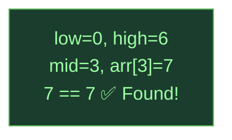
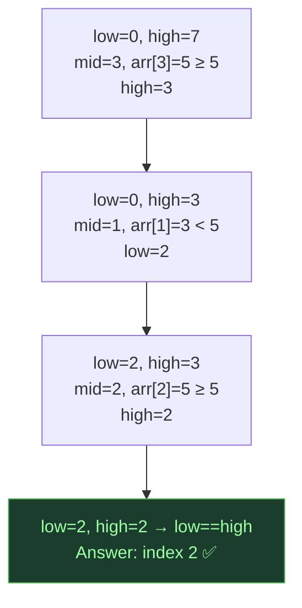
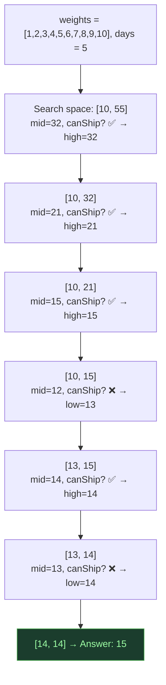
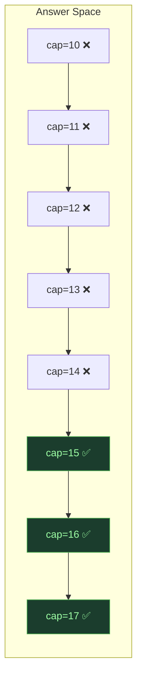

# Binary Search on Array — Halving the Search Space

## One-Line Mental Model

If a **monotonic property** exists, halve the search space every step — works on sorted arrays *and* on abstract answer spaces.

## Core Idea

Binary search isn't just "find element in sorted array." It's a **decision framework**: given a predicate `f(x)` that transitions from `false → true` (or vice versa), find the boundary. This works on:

1. **Sorted arrays** — classic element search
2. **Answer space** — "what's the minimum/maximum value such that condition holds?"

> **If you're not using binary search on answer frequently, you're missing medium-hard problems.**

## Recognition Signals

- Input is **sorted**
- "Find the position of…"
- "Minimum value such that…" / "Maximum value such that…"
- A **feasibility check** exists for candidate answers
- Monotonic property: if `f(x)` is true, then `f(x+1)` is also true

## Template Code

### Classic Binary Search

```go
func binarySearch(arr []int, target int) int {
    low, high := 0, len(arr)-1

    for low <= high {
        mid := low + (high-low)/2 // avoid overflow
        if arr[mid] == target {
            return mid
        } else if arr[mid] < target {
            low = mid + 1
        } else {
            high = mid - 1
        }
    }
    return -1
}
```

### Lower Bound (First occurrence ≥ target)

```go
func lowerBound(arr []int, target int) int {
    low, high := 0, len(arr)

    for low < high {
        mid := low + (high-low)/2
        if arr[mid] < target {
            low = mid + 1
        } else {
            high = mid // don't skip mid — it might be the answer
        }
    }
    return low // first index where arr[index] >= target
}
```

### Binary Search on Answer

```go
func minCapacity(weights []int, days int) int {
    low := maxElement(weights)      // minimum possible
    high := sum(weights)            // maximum possible

    for low < high {
        mid := low + (high-low)/2
        if canShipInDays(weights, mid, days) {
            high = mid              // feasible → try smaller
        } else {
            low = mid + 1           // not feasible → need bigger
        }
    }
    return low
}

func canShipInDays(weights []int, capacity, days int) bool {
    daysNeeded, currentLoad := 1, 0
    for _, w := range weights {
        if currentLoad+w > capacity {
            daysNeeded++
            currentLoad = 0
        }
        currentLoad += w
    }
    return daysNeeded <= days
}
```

## When To Use

- Search in sorted array
- Find first/last occurrence
- Search in rotated sorted array
- Find peak element
- Minimum in rotated array
- Capacity to ship packages within D days
- Koko eating bananas
- Split array largest sum
- Median of two sorted arrays

## Why Naive Fails

Linear scan is O(n). Binary search is O(log n). For answer-space problems, brute force tries all possible answers → O(range). Binary search on answer → O(log(range) × check_cost).

## Binary Search on Answer Framework

```
1. Define search space: [min_possible, max_possible]
2. Define feasibility check: can we achieve goal with value = mid?
3. Prove monotonicity: if feasible(x), then feasible(x+1)? (or vice versa)
4. Binary search the boundary
```

> **If you don't prove monotonicity, you're gambling.** The search only works if the predicate transitions cleanly from false→true (or true→false).

## Invariant Contract

```
INVARIANT: answer is always in [low, high]
GUARANTEE: search space halves every iteration
PROOF: mid splits [low, high]; one half is eliminated → terminates in O(log n)
```

## Common Mistakes

1. **Overflow in `(low + high) / 2`** — use `low + (high - low) / 2`
2. **Wrong loop condition** — `low <= high` vs `low < high` (depends on template)
3. **Infinite loop** — when `low = high - 1` and `mid = low`, always ensure progress
4. **Not proving monotonicity** for binary search on answer
5. **Off-by-one in boundaries** — inclusive vs exclusive high

## Mermaid Visualization

### Classic: Find 7 in `[1, 3, 5, 7, 9, 11, 13]`



### Lower Bound: First ≥ 5 in `[1, 3, 5, 5, 5, 8, 10]`



### Binary Search on Answer: Ship packages



### Monotonicity Proof Pattern



> **Key insight**: Binary search on answer is one of the most powerful techniques for medium-hard problems. The answer space often has a clear monotonic boundary — find it.

## Complexity

| Metric | Value |
|--------|-------|
| Classic | O(log n) |
| On Answer | O(log(range) × feasibility_check) |
| Space | O(1) |

## Edge Cases

- Empty array → return -1
- Single element → check directly
- All same elements → lower/upper bound matters
- Target not present → return insertion point or -1
- Integer overflow in mid calculation
- Rotated array → modified comparison logic
