# Hashing + Array — Frequency & Lookup

## One-Line Mental Model

Trade O(n) space for O(1) lookups — use a hashmap for general domains or a counting array when the domain is small and bounded.

## Core Idea

Many array problems reduce to "have I seen this before?" or "how many times has this appeared?". A hashmap answers both in O(1). When the input domain is small (≤ 10⁵), a plain array as a counting bucket is *faster* than a hashmap (no hashing overhead, cache-friendly).

### Decision Matrix

| Domain Size | Use |
|-------------|-----|
| Unbounded / large | `map[int]int` |
| ≤ 26 (lowercase letters) | `[26]int` |
| ≤ 128 (ASCII) | `[128]int` |
| ≤ 10⁵ | `[]int` array |
| > 10⁵ unbounded | HashMap |

> **Performance maturity** means knowing when to drop the hashmap for an array.

## Recognition Signals

- "Find duplicates"
- "First non-repeating"
- "Frequency of elements"
- "Check if anagram"
- "Two sum" (unsorted)
- "Group by property"

## Template Code

### HashMap Frequency

```go
func twoSum(nums []int, target int) []int {
    seen := make(map[int]int) // value → index

    for i, num := range nums {
        complement := target - num
        if j, ok := seen[complement]; ok {
            return []int{j, i}
        }
        seen[num] = i
    }
    return nil
}
```

### Array as Counting Bucket

```go
func isAnagram(s, t string) bool {
    if len(s) != len(t) { return false }

    var freq [26]int
    for i := 0; i < len(s); i++ {
        freq[s[i]-'a']++
        freq[t[i]-'a']--
    }
    for _, count := range freq {
        if count != 0 { return false }
    }
    return true
}
```

### In-Place Array Marking (O(1) space)

```go
func findDuplicates(nums []int) []int {
    // For nums in range [1, n], use index as hash
    var result []int
    for _, num := range nums {
        idx := abs(num) - 1
        if nums[idx] < 0 {
            result = append(result, abs(num))
        } else {
            nums[idx] = -nums[idx]
        }
    }
    return result
}
```

## When To Use

- Two Sum (unsorted)
- Valid Anagram / Group Anagrams
- First Unique Character
- Find All Duplicates
- Contains Duplicate (within distance K)
- Intersection of Two Arrays
- Longest Consecutive Sequence
- Majority Element

## Why Naive Fails

Brute force for "have I seen X?" is O(n) scan each time → O(n²) total. HashMap: O(1) lookup → O(n) total. Array bucket: even faster due to cache locality and no hash computation.

## Array as Hash — Advanced Tricks

### 1. In-Place Marking
When values are in range `[1, n]`, negate `arr[val-1]` to mark presence. O(1) space.

### 2. Cyclic Sort
When values are in `[1, n]`, swap each to its "home" index. What's not at home is missing/duplicate.

### 3. Value as Index
Use `arr[value]` directly when domain allows — instant O(1) frequency.

## Mermaid Visualization

### Two Sum with HashMap: `[2, 7, 11, 15]`, target=9

```mermaid
flowchart TD
    S0["seen = {}, target = 9"]
    S1["i=0: num=2, need 7
7 not in seen
seen = {2→0}"]
    S2["i=1: num=7, need 2
2 in seen at index 0 ✅
return [0, 1]"]

    S0 --> S1 --> S2

    style S2 fill:#1b3d2d,color:#9effa5,stroke:#4caf50
```



### Anagram Check: Array Bucket

```mermaid
flowchart LR
    subgraph "Input"
        W1["s = 'listen'"]
        W2["t = 'silent'"]
    end
    subgraph "Frequency Array [26]"
        F["e:+1-1=0, i:+1-1=0, l:+1-1=0
n:+1-1=0, s:+1-1=0, t:+1-1=0"]
    end
    subgraph "Result"
        R["All zeros → ✅ Anagram"]
    end

    W1 --> F
    W2 --> F
    F --> R

    style R fill:#1b3d2d,color:#9effa5,stroke:#4caf50
```



### In-Place Marking: Find duplicates in `[4, 3, 2, 7, 8, 2, 3, 1]`

```mermaid
flowchart TD
    S0["Array: [4, 3, 2, 7, 8, 2, 3, 1]"]
    S1["num=4 → negate idx 3
[4, 3, 2, -7, 8, 2, 3, 1]"]
    S2["num=3 → negate idx 2
[4, 3, -2, -7, 8, 2, 3, 1]"]
    S3["num=2 → negate idx 1
[4, -3, -2, -7, 8, 2, 3, 1]"]
    S4["num=7 → negate idx 6
[4, -3, -2, -7, 8, 2, -3, 1]"]
    S5["num=8 → negate idx 7
[4, -3, -2, -7, 8, 2, -3, -1]"]
    S6["num=2 → idx 1 already negative!
🔴 Duplicate: 2"]
    S7["num=3 → idx 2 already negative!
🔴 Duplicate: 3"]

    S0 --> S1 --> S2 --> S3 --> S4 --> S5 --> S6 --> S7

    style S6 fill:#2d1b36,color:#ff9e9e,stroke:#ff5252
    style S7 fill:#2d1b36,color:#ff9e9e,stroke:#ff5252
```



> **Key insight**: When domain is bounded `[1, n]`, you can use the array itself as a hash table with O(1) space. This is interview gold.

## Complexity

| Approach | Time | Space |
|----------|------|-------|
| HashMap | O(n) | O(n) |
| Array bucket | O(n) | O(domain) |
| In-place marking | O(n) | O(1) |

## Edge Cases

- Empty input → return default
- All duplicates → frequency count handles
- Single element → no pairs possible
- Negative values → can't use array-as-index trick (use offset or map)
- Zero in input → watch for `0 - 'a'` underflow
