# Kadane's Algorithm — Maximum Subarray

## One-Line Mental Model

At every index, make one decision: **extend the previous subarray** or **start fresh** — whichever gives a larger sum.

## Core Idea

This is DP disguised as a greedy scan. Define `current` as the maximum subarray ending at index `i`. At each step:

```
current = max(arr[i], current + arr[i])
```

If `current + arr[i] < arr[i]`, the prefix sum is negative — carrying it forward only hurts. Drop it. Start fresh from `arr[i]`.

> **If you can't derive Kadane from DP thinking, you don't understand it.** The recurrence is `dp[i] = max(arr[i], dp[i-1] + arr[i])`. Kadane optimizes this to O(1) space by noting `dp[i]` only depends on `dp[i-1]`.

## Recognition Signals

- "Maximum / minimum subarray sum"
- "Contiguous subarray optimization"
- "Best time to buy and sell stock" (variant)
- "Maximum product subarray" (modified Kadane)
- "Largest sum contiguous subarray"

## Template Code

### Maximum Subarray Sum

```go
func maxSubarraySum(arr []int) int {
    current := arr[0]
    best := arr[0]

    for i := 1; i < len(arr); i++ {
        // Core decision: extend or restart
        current = max(arr[i], current+arr[i])
        best = max(best, current)
    }
    return best
}
```

### With Index Tracking

```go
func maxSubarrayWithIndices(arr []int) (int, int, int) {
    current, best := arr[0], arr[0]
    start, end, tempStart := 0, 0, 0

    for i := 1; i < len(arr); i++ {
        if arr[i] > current+arr[i] {
            current = arr[i]
            tempStart = i // start fresh
        } else {
            current += arr[i]
        }
        if current > best {
            best = current
            start = tempStart
            end = i
        }
    }
    return best, start, end
}
```

### Maximum Product Subarray (Modified)

```go
func maxProduct(nums []int) int {
    maxProd, minProd, result := nums[0], nums[0], nums[0]

    for i := 1; i < len(nums); i++ {
        if nums[i] < 0 {
            maxProd, minProd = minProd, maxProd // swap: negative flips max/min
        }
        maxProd = max(nums[i], maxProd*nums[i])
        minProd = min(nums[i], minProd*nums[i])
        result = max(result, maxProd)
    }
    return result
}
```

## When To Use

- Maximum Subarray (LC 53)
- Maximum Product Subarray
- Best Time to Buy and Sell Stock
- Maximum Circular Subarray (Kadane + total - minKadane)
- Maximum Sum with No Adjacent Elements (House Robber variant)

## Why Naive Fails

Checking all O(n²) subarrays and computing each sum in O(n) → O(n³). Even with prefix sums → O(n²). Kadane's key insight: the max subarray ending at `i` only depends on the max subarray ending at `i-1`. Single scan → O(n).

## DP Derivation (The Real Understanding)

```
State:     dp[i] = max subarray sum ENDING at index i
Recurrence: dp[i] = max(arr[i], dp[i-1] + arr[i])
Answer:    max(dp[0], dp[1], ..., dp[n-1])
Space:     dp[i] only depends on dp[i-1] → optimize to O(1)
```

Why drop negative prefix? If `dp[i-1] < 0`, then `dp[i-1] + arr[i] < arr[i]`. The prefix is a burden. Starting fresh at `arr[i]` is strictly better.

## Invariant Contract

```
INVARIANT: current = max subarray sum ending at current index
GUARANTEE: best = max over all "current" values seen so far
PROOF: we consider ALL possible ending positions → answer is correct
```

## Common Mistakes

1. **Initializing to 0** — fails when all elements are negative (answer should be the largest negative number)
2. **Not handling all-negative arrays** — must start `best = arr[0]`, not `best = 0`
3. **Confusing max product with max sum** — product needs both max and min tracking (negatives flip)
4. **Forgetting the "start fresh" case** — `current = max(arr[i], current + arr[i])`, not `current += arr[i]`

## Mermaid Visualization

### Kadane on `[-2, 1, -3, 4, -1, 2, 1, -5, 4]`

```mermaid
flowchart TD
    S0["i=0: arr=-2\ncurrent=max(-2, -2)=-2\nbest=-2"]
    S1["i=1: arr=1\ncurrent=max(1, -2+1)=1 🔄 restart\nbest=1"]
    S2["i=2: arr=-3\ncurrent=max(-3, 1-3)=-2 → extend\nbest=1"]
    S3["i=3: arr=4\ncurrent=max(4, -2+4)=4 🔄 restart\nbest=4"]
    S4["i=4: arr=-1\ncurrent=max(-1, 4-1)=3 → extend\nbest=4"]
    S5["i=5: arr=2\ncurrent=max(2, 3+2)=5 → extend\nbest=5"]
    S6["i=6: arr=1\ncurrent=max(1, 5+1)=6 → extend\nbest=6 ✅"]
    S7["i=7: arr=-5\ncurrent=max(-5, 6-5)=1 → extend\nbest=6"]
    S8["i=8: arr=4\ncurrent=max(4, 1+4)=5 → extend\nbest=6"]

    S0 --> S1 --> S2 --> S3 --> S4 --> S5 --> S6 --> S7 --> S8

    style S1 fill:#1e3a5f,color:#90caf9,stroke:#42a5f5
    style S3 fill:#1e3a5f,color:#90caf9,stroke:#42a5f5
    style S6 fill:#1b3d2d,color:#9effa5,stroke:#4caf50
```



### Decision Diagram: Extend vs Restart


> **Key insight**: The decision is simple — is the accumulated prefix helping or hurting? If `current < 0`, it's hurting every future element it touches. Drop it.

## Complexity

| Metric | Value |
|--------|-------|
| Time | O(n) — single pass |
| Space | O(1) — two variables |

## Edge Cases

- All negative → answer is the *largest* negative number
- All positive → answer is the entire array sum
- Single element → answer is that element
- Array of zeros → answer is 0
- Overflow → use int64 for large sums
