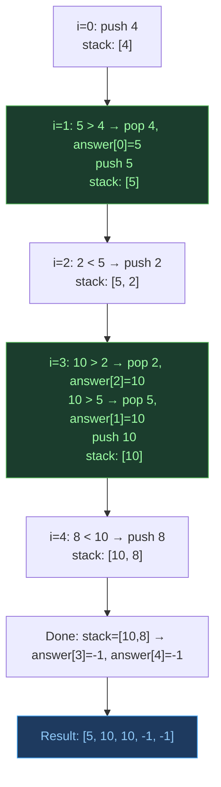
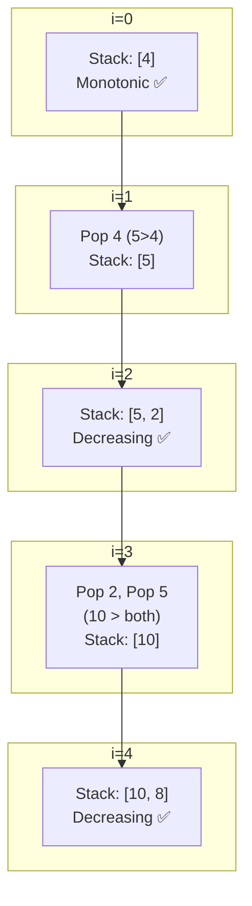
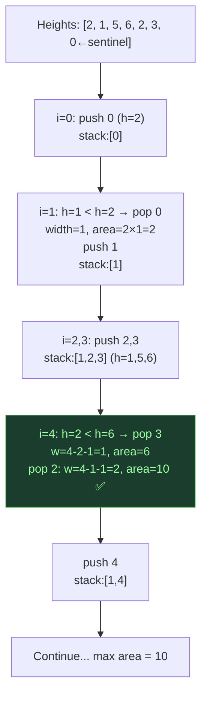

# Monotonic Stack — Next Greater/Smaller Element

## One-Line Mental Model

Maintain a stack where elements are always in sorted order (increasing or decreasing); pop elements that violate the invariant — each popped element finds its "answer" at that moment.

## Core Idea

A monotonic stack processes elements left-to-right. When a new element arrives, pop all elements from the stack that violate the monotonic order. Each popped element has just found its "next greater" (or "next smaller") — the current element. Elements remaining in the stack at the end have no answer (default to -1).

### Two Variants

| Stack Type | Pop When | Finds |
|------------|----------|-------|
| **Monotonic Decreasing** | `new > stack.top` | Next Greater Element |
| **Monotonic Increasing** | `new < stack.top` | Next Smaller Element |

> **Strong candidates understand: Why does popping guarantee future correctness?** Because if element A is smaller than element B and B comes before A in the stack, A can never be the "next greater" for anything — B is both closer and larger. So popping A is safe.

## Recognition Signals

- "Next greater element" / "Next smaller element"
- "Largest rectangle in histogram"
- "Daily temperatures" (how many days until warmer)
- "Stock span problem"
- "Trapping rain water" (can also use two-pointer)
- Problems asking about *influence range* of each element

## Template Code

### Next Greater Element

```go
func nextGreater(arr []int) []int {
    n := len(arr)
    result := make([]int, n)
    for i := range result { result[i] = -1 }

    stack := []int{} // stores indices

    for i := 0; i < n; i++ {
        // Pop all elements smaller than current
        for len(stack) > 0 && arr[stack[len(stack)-1]] < arr[i] {
            top := stack[len(stack)-1]
            stack = stack[:len(stack)-1]
            result[top] = arr[i] // current element is the answer for top
        }
        stack = append(stack, i)
    }
    return result
}
```

### Next Smaller Element

```go
func nextSmaller(arr []int) []int {
    n := len(arr)
    result := make([]int, n)
    for i := range result { result[i] = -1 }

    stack := []int{}

    for i := 0; i < n; i++ {
        for len(stack) > 0 && arr[stack[len(stack)-1]] > arr[i] {
            top := stack[len(stack)-1]
            stack = stack[:len(stack)-1]
            result[top] = arr[i]
        }
        stack = append(stack, i)
    }
    return result
}
```

### Largest Rectangle in Histogram

```go
func largestRectangle(heights []int) int {
    stack := []int{}
    maxArea := 0
    heights = append(heights, 0) // sentinel

    for i, h := range heights {
        for len(stack) > 0 && heights[stack[len(stack)-1]] > h {
            top := stack[len(stack)-1]
            stack = stack[:len(stack)-1]
            width := i
            if len(stack) > 0 {
                width = i - stack[len(stack)-1] - 1
            }
            maxArea = max(maxArea, heights[top]*width)
        }
        stack = append(stack, i)
    }
    return maxArea
}
```

## When To Use

- Next Greater Element (I, II, circular)
- Next Smaller Element
- Daily Temperatures
- Stock Span Problem
- Largest Rectangle in Histogram
- Maximal Rectangle
- Trapping Rain Water
- Sum of Subarray Minimums
- Asteroid Collision

## Why Naive Fails

For each element, scanning right for the next greater → O(n²). Monotonic stack: each element is pushed once and popped once → O(2n) = O(n).

## Why Popping is Safe (The Real Understanding)

Consider a decreasing stack with `[5, 3]` and new element `4` arrives:

- `3` gets popped, answer = `4` ✅
- But why is `3` safe to remove? Because any future element looking for "next greater than 3" would find `4` first (closer and larger). So `3` is no longer useful.
- `5` stays: `4 < 5`, so `5` might still be someone's answer.

**The stack maintains a "shadow" — only elements that could still be relevant remain.**

## Invariant Contract

```
INVARIANT: stack elements are always in monotonic order (increasing or decreasing)
GUARANTEE: each element is pushed once, popped once → O(n)
PROOF: popped element found its answer; remaining elements can never be
       answered by anything closer → safe to hold
```

## Common Mistakes

1. **Storing values instead of indices** — you usually need both value and position
2. **Wrong comparison direction** — strictly greater vs greater-or-equal
3. **Missing sentinel** — add a 0 at the end for histogram problems to flush the stack
4. **Circular arrays** — process array twice (or mod index) for circular next greater

## Mermaid Visualization

### Next Greater Element for `[4, 5, 2, 10, 8]`



### Stack State Evolution



### Histogram: `[2, 1, 5, 6, 2, 3]`



> **Key insight**: The stack acts as a "filtered history" — only elements that could still influence future answers remain. Everything irrelevant has already been answered and removed.

## Complexity

| Metric | Value |
|--------|-------|
| Time | O(n) — each element pushed and popped at most once |
| Space | O(n) — stack size |

## Edge Cases

- All ascending → nothing gets popped until end; all answers are the next element
- All descending → each element pops the previous; stack always has 1 element
- All same → depends on strict vs non-strict comparison
- Single element → answer is -1
- Circular array → process `2n` elements with `i % n`
