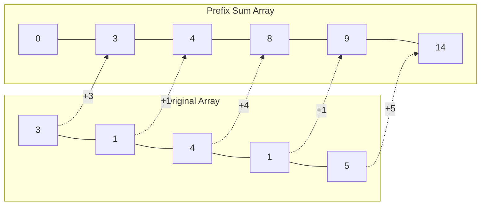
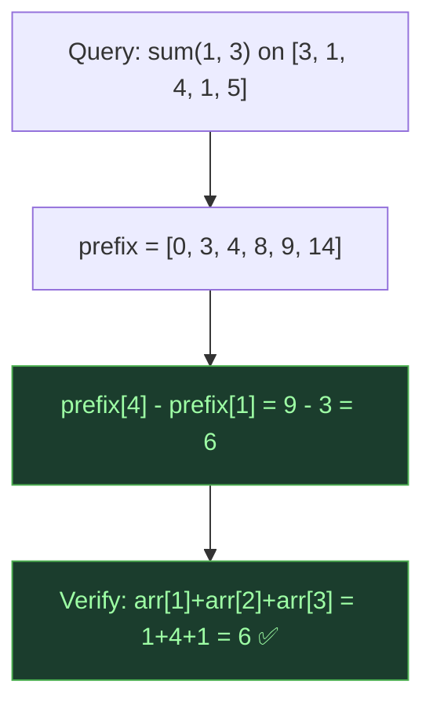
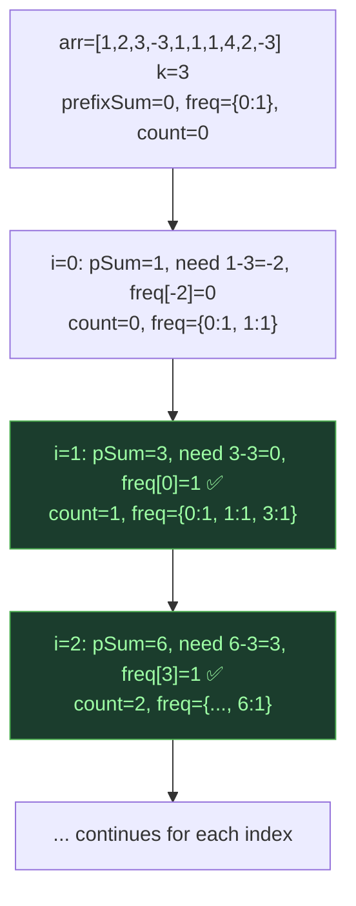
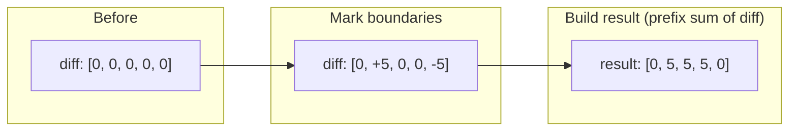

# Prefix Sum — Precomputed Range Queries

## One-Line Mental Model

Build a cumulative sum array once; answer *any* range sum query in O(1) via `prefix[r] - prefix[l-1]`.

## Core Idea

Precompute `prefix[i] = arr[0] + arr[1] + ... + arr[i]`. Any subarray sum `sum(l, r)` becomes a single subtraction. This transforms O(n) per query into O(1) per query after O(n) preprocessing. The trade-off: O(n) space for O(1) query time.

### Key Identity

```
sum(l, r) = prefix[r] - prefix[l-1]
```

Where `prefix[-1] = 0` by convention (use 1-indexed prefix or handle offset).

## Recognition Signals

- "Range sum query" → prefix sum
- "Count subarrays with sum = K" → prefix sum + hashmap
- "How many subarrays…" → prefix frequency map should trigger **instantly**
- Multiple queries on same array → preprocess once
- Subarray sum comparisons

## Template Code

### Basic Prefix Sum

```go
func buildPrefix(arr []int) []int {
    prefix := make([]int, len(arr)+1)
    for i := 0; i < len(arr); i++ {
        prefix[i+1] = prefix[i] + arr[i]
    }
    return prefix
    // sum(l, r) = prefix[r+1] - prefix[l]  (0-indexed arr)
}

func rangeSum(prefix []int, l, r int) int {
    return prefix[r+1] - prefix[l]
}
```

### Subarray Sum Equals K (Prefix + HashMap)

```go
func subarraySum(nums []int, k int) int {
    count := 0
    prefixSum := 0
    freq := map[int]int{0: 1} // empty prefix

    for _, num := range nums {
        prefixSum += num
        // If (prefixSum - k) was seen before, those subarrays sum to k
        count += freq[prefixSum-k]
        freq[prefixSum]++
    }
    return count
}
```

### Difference Array (Range Updates)

```go
func rangeAdd(diff []int, l, r, val int) {
    diff[l] += val
    if r+1 < len(diff) {
        diff[r+1] -= val
    }
}

func buildFromDiff(diff []int) []int {
    result := make([]int, len(diff))
    result[0] = diff[0]
    for i := 1; i < len(diff); i++ {
        result[i] = result[i-1] + diff[i]
    }
    return result
}
```

## When To Use

- Range sum queries (multiple)
- Subarray sum equals K (prefix + hashmap)
- Count subarrays with given sum
- Equilibrium index
- Product of array except self
- Difference array for range updates
- Prefix XOR for range XOR queries

## Why Naive Fails

Each range sum query takes O(n) by iterating. With Q queries → O(n·Q). Prefix sum: O(n) build + O(1) per query = O(n + Q). When Q is large, this is the difference between TLE and AC.

## Advanced Forms

| Variant | Identity | Use Case |
|---------|----------|----------|
| **Prefix Sum** | `prefix[r] - prefix[l-1]` | Range sum |
| **Prefix XOR** | `prefixXor[r] ^ prefixXor[l-1]` | Range XOR |
| **Prefix Frequency** | `freqMap[prefixSum]` | Count subarrays with sum K |
| **Difference Array** | `diff[l] += v, diff[r+1] -= v` | Batch range updates |
| **2D Prefix Sum** | Inclusion-exclusion on rectangle | Matrix range sum |

## Invariant Contract

```
INVARIANT: prefix[i] = sum of arr[0..i-1]
GUARANTEE: any range query [l, r] answerable in O(1)
PROOF: sum(l, r) = prefix[r+1] - prefix[l] by telescoping sums
```

## Common Mistakes

1. **Off-by-one** — 0-indexed vs 1-indexed prefix array (most bugs here)
2. **Forgetting `{0: 1}`** in hashmap approach — the empty prefix matters
3. **Integer overflow** — prefix sums can exceed int32 range
4. **Modifying array after building prefix** — prefix is a snapshot, not live

## Mermaid Visualization

### Prefix Sum Construction for `[3, 1, 4, 1, 5]`



### Range Query: sum(1, 3) = prefix[4] - prefix[1]



### Subarray Sum = K with HashMap



### Difference Array: Add +5 to range [1,3]



> **Key insight**: "How many subarrays have sum = K?" → Don't iterate all pairs. Use `prefixSum - K` lookups in a hashmap. This is the #1 underused optimization.

## Complexity

| Metric | Value |
|--------|-------|
| Build | O(n) |
| Query | O(1) per range query |
| Space | O(n) |

## Edge Cases

- Empty array → prefix = [0]
- Single element → prefix = [0, arr[0]]
- All zeros → every prefix is the same
- Negative numbers → prefix can decrease (still works)
- Overflow → use int64
