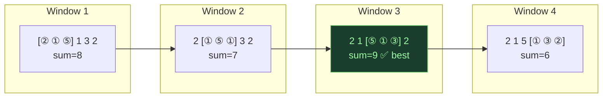
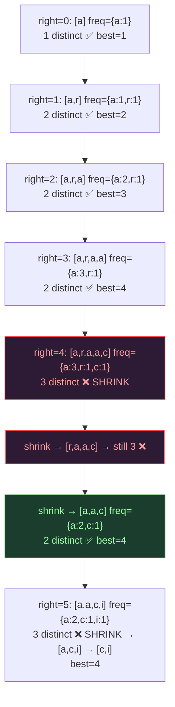
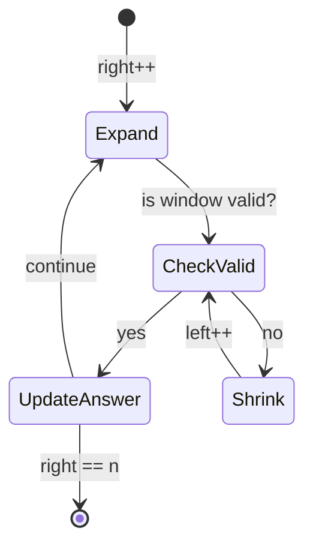

# Sliding Window — Fixed & Variable

## One-Line Mental Model

A window `[left, right]` slides over the array; `right` always advances, `left` advances to restore validity — every element enters and exits at most once → O(n).

## Core Idea

Maintain a contiguous subarray (window) with a **validity invariant**. Expand `right` to include new elements. When the invariant breaks, shrink from `left` until valid again. Update the answer at each valid state. The window never jumps backward — this is what makes it O(n).

### Two Types

| Type | Window Size | Shrink Condition |
|------|-------------|-----------------|
| **Fixed** | Exactly `k` | When `right - left + 1 > k` |
| **Variable** | Dynamic | When constraint is violated |

> **Critical**: If you don't explicitly define what "valid" means for your window, you *will* fail.

## Recognition Signals

- Keywords: "subarray", "substring", "contiguous"
- Optimize: longest, shortest, maximum sum, minimum length
- Constraint on window content (distinct count, sum limit, character frequency)

## Template Code

### Fixed Window

```go
func fixedWindow(arr []int, k int) int {
    windowSum := 0
    best := math.MinInt32

    for right := 0; right < len(arr); right++ {
        windowSum += arr[right]

        if right >= k {
            windowSum -= arr[right-k] // remove leftmost of previous window
        }

        if right >= k-1 {
            best = max(best, windowSum)
        }
    }
    return best
}
```

### Variable Window

```go
func variableWindow(s string, k int) int {
    freq := make(map[byte]int)
    left, best := 0, 0

    for right := 0; right < len(s); right++ {
        // 1. EXPAND — include new element
        freq[s[right]]++

        // 2. FIX VIOLATION — shrink until valid
        for len(freq) > k {
            freq[s[left]]--
            if freq[s[left]] == 0 {
                delete(freq, s[left])
            }
            left++
        }

        // 3. UPDATE ANSWER
        best = max(best, right-left+1)
    }
    return best
}
```

## When To Use

- Maximum sum subarray of size K (fixed)
- Longest substring with at most K distinct characters (variable)
- Minimum window substring containing all characters (variable)
- Longest subarray with sum ≤ K (variable)
- Maximum of all subarrays of size K (fixed + deque)
- Longest repeating character replacement (variable)

## Why Naive Fails

Checking every `[i, j]` pair is O(n²). Sliding window maintains state incrementally: add `arr[right]`, remove `arr[left]`. Each element enters once, leaves once → O(n). The critical mistake: resetting `left` to 0 on each outer iteration.

## Invariant Contract

```
INVARIANT: window [left, right] is always valid after the shrink step
GUARANTEE: left ≤ right, both monotonically non-decreasing
PROOF: each element enters window once (right++), leaves once (left++) → O(2n) = O(n)
```

## Correct Mental Model (Order Matters!)

```
❌ WRONG: Think first → expand → check
✅ RIGHT: Expand → fix violation → update answer
```

If you expand first and think later, you'll forget edge cases in the shrink logic.

## Common Mistakes

1. **Not defining "valid"** — what exact condition must the window satisfy?
2. **Using `if` instead of `for`** in shrink step — window may need to shrink multiple positions
3. **Updating answer before fixing violation** — answer includes invalid state
4. **Resetting left pointer** — left must only move forward, never backward

## Mermaid Visualization

### Fixed Window: Max sum of size 3 in `[2, 1, 5, 1, 3, 2]`



### Variable Window: Longest substring ≤ 2 distinct in `"araaci"`



### Window Lifecycle



> **Key insight**: `right` always moves forward. `left` only moves forward. Total pointer movements ≤ 2n → O(n).

## Complexity

| Metric | Value |
|--------|-------|
| Time | O(n) — each element enters/exits window once |
| Space | O(k) for frequency map or O(1) for fixed window |

## Edge Cases

- `k > n` → window can never be full (fixed) or constraint never violated (variable)
- `k = 0` → degenerate, return 0
- All same elements → window = entire array
- Empty string/array → return 0
