# Two Pointer — Converging Search

## One-Line Mental Model

Two pointers walk inward on sorted data, each step **provably** eliminating one candidate — turning O(n²) pair-search into O(n).

## Core Idea

Place `left` at index 0 and `right` at index `n-1`. Evaluate a condition comparing `arr[left]` and `arr[right]`. Move the pointer whose side *cannot improve* the answer. The invariant: everything outside `[left, right]` has been ruled out. The search space shrinks by exactly one element per step.

> **Why it works**: In a sorted array, moving `left` right *increases* the contribution from the left. Moving `right` left *decreases* it. This monotonic relationship lets you discard one end with certainty.

## Recognition Signals

- Input is **sorted** (or can be sorted)
- Problem asks for a **pair/triplet** satisfying a condition
- Brute-force is O(n²) nested loops over pairs
- Keywords: "two numbers that sum to", "closest pair", "container with most water"

## Template Code

```go
func twoPointer(arr []int, target int) (int, int) {
    left, right := 0, len(arr)-1

    for left < right {
        sum := arr[left] + arr[right]
        if sum == target {
            return left, right
        } else if sum < target {
            left++ // need larger value → move left forward
        } else {
            right-- // need smaller value → move right backward
        }
    }
    return -1, -1 // no valid pair
}
```

### 3Sum Extension

```go
func threeSum(nums []int) [][]int {
    sort.Ints(nums)
    var result [][]int

    for i := 0; i < len(nums)-2; i++ {
        if i > 0 && nums[i] == nums[i-1] { continue } // skip duplicates
        left, right := i+1, len(nums)-1
        for left < right {
            sum := nums[i] + nums[left] + nums[right]
            if sum == 0 {
                result = append(result, []int{nums[i], nums[left], nums[right]})
                for left < right && nums[left] == nums[left+1] { left++ }
                for left < right && nums[right] == nums[right-1] { right-- }
                left++; right--
            } else if sum < 0 {
                left++
            } else {
                right--
            }
        }
    }
    return result
}
```

## When To Use

- Two Sum (sorted array)
- 3Sum / 4Sum
- Container With Most Water
- Trapping Rain Water
- Remove Duplicates from Sorted Array
- Merge Sorted Arrays
- Valid Palindrome

## Why Naive Fails

Nested loops check all O(n²) pairs. Two pointers exploit sorted order: if `sum < target`, the *only* way to increase it is `left++` (right side already maximal). Each pointer moves at most `n` times → O(n).

## Invariant Contract

```
INVARIANT: left ≤ right
GUARANTEE: search space [left, right] shrinks by 1 every iteration
PROOF: at least one pointer moves each step → terminates in ≤ n steps
```

## Common Mistakes

1. **Moving pointer without justification** — why does moving `left` right help? If you can't answer, you're memorizing
2. **Forgetting to skip duplicates** in 3Sum — leads to duplicate triplets
3. **Using on unsorted data** — two pointer convergence requires monotonic relationship
4. **Off-by-one on loop condition** — `left < right` vs `left <= right` depends on whether you can pair an element with itself

## Mermaid Visualization

Two Sum with target 9 on `[1, 3, 4, 6, 8, 10]`:

```mermaid
flowchart TD
    S0["🔍 Array: [1, 3, 4, 6, 8, 10]  target=9"]
    S1["L=0, R=5 → 1+10=11 > 9\n❌ Sum too big → R--"]
    S2["L=0, R=4 → 1+8=9\n✅ Found pair!"]

    S0 --> S1 --> S2

    style S0 fill:#1a1a2e,color:#e0e0ff,stroke:#7c4dff
    style S1 fill:#2d1b36,color:#ff9e9e,stroke:#ff5252
    style S2 fill:#1b3d2d,color:#9effa5,stroke:#4caf50
```



Search space shrinking:

```mermaid
graph LR
    subgraph "Step 0 — full range"
        A["[①  3  4  6  8  ⑩]"]
    end
    subgraph "Step 1 — R moves left"
        B["[①  3  4  6  ⑧  ×]"]
    end
    subgraph "Step 2 — Found!"
        C["[ ①  3  4  6  ⑧ ] ✅"]
    end

    A --> B --> C
```



> **Key insight**: Each pointer move *provably* eliminates one element. If `sum > target`, no pairing of `arr[right]` with any `arr[j]` where `j > left` can work — because they'd be even larger.

## Complexity

| Metric | Value |
|--------|-------|
| Time | O(n) for two-pointer pass (O(n²) for 3Sum with sorted input) |
| Space | O(1) |

## Edge Cases

- Empty array → return immediately
- Single element → no pair possible
- All same elements → handle duplicates
- Negative numbers → works fine with sorted array
- Multiple valid pairs → define return policy (first found vs all)
