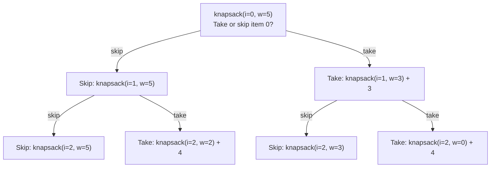

# 0/1 Knapsack — Bounded Choice DP

## Core Idea

Given items with weights and values, maximize total value without exceeding capacity. Each item is either **taken or skipped** (0/1). The recurrence: `dp[i][w] = max(dp[i-1][w], dp[i-1][w-wt[i]] + val[i])`. The first term = skip item `i`, the second = take it. Can be space-optimized to 1D by iterating capacity **right to left**.

## Template Code

```go
func knapsack(weights, values []int, capacity int) int {
    dp := make([]int, capacity+1)

    for i := 0; i < len(weights); i++ {
        // Iterate right-to-left to avoid using same item twice
        for w := capacity; w >= weights[i]; w-- {
            dp[w] = max(dp[w], dp[w-weights[i]]+values[i])
        }
    }
    return dp[capacity]
}
```

## When To Use

- "Pick items to maximize/minimize with a budget/limit"
- Subset sum, partition equal subset
- Coin change (unbounded = left-to-right instead)
- Any problem with **binary choices** and a **capacity constraint**

## Why Naive Fails

Brute force tries all 2^n subsets → O(2^n). DP reduces to O(n × capacity) by reusing overlapping subproblems. The critical mistake: iterating left-to-right in 1D DP uses the same item multiple times (that's the **unbounded** variant).

## Mermaid Visualization

Items: `[(wt:2, val:3), (wt:3, val:4), (wt:4, val:5)]`, Capacity: 5



> **Key insight**: Right-to-left iteration in 1D ensures `dp[w-wt[i]]` reads the *previous* row's value, not one already updated this round.
