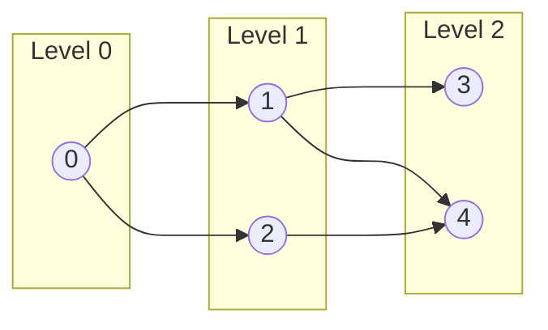
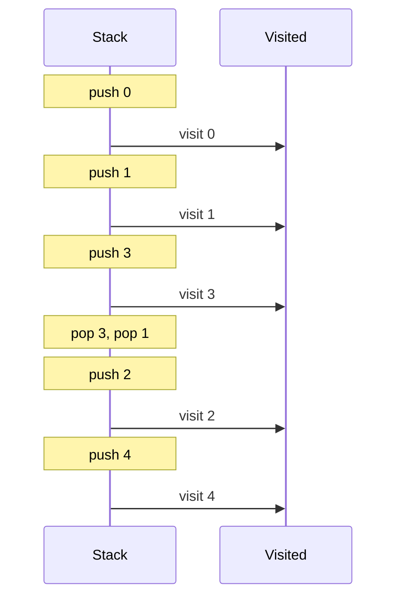

# BFS & DFS — Graph Traversal Patterns

## Core Idea

**DFS** goes deep before wide — uses a stack (or recursion). Best for path-finding, cycle detection, topological ordering. **BFS** goes wide before deep — uses a queue. Best for shortest path (unweighted), level-order processing. Both need a `visited` set to avoid infinite loops in graphs with cycles.

## Template Code

### DFS (Recursive)
```go
func dfs(graph map[int][]int, node int, visited map[int]bool) {
    if visited[node] {
        return
    }
    visited[node] = true
    // process node
    for _, neighbor := range graph[node] {
        dfs(graph, neighbor, visited)
    }
}
```

### BFS (Iterative)
```go
func bfs(graph map[int][]int, start int) {
    visited := map[int]bool{start: true}
    queue := []int{start}

    for len(queue) > 0 {
        node := queue[0]
        queue = queue[1:]
        // process node
        for _, neighbor := range graph[node] {
            if !visited[neighbor] {
                visited[neighbor] = true
                queue = append(queue, neighbor)
            }
        }
    }
}
```

## When To Use

| Use DFS when… | Use BFS when… |
|---|---|
| Finding any path | Finding **shortest** path (unweighted) |
| Cycle detection | Level-order traversal |
| Topological sort | Multi-source spread (rotting oranges) |
| Connected components | Min steps to transform |

## Why Naive Fails

- **Forgetting `visited`** → infinite loop in cyclic graphs
- **Using DFS for shortest path** → DFS finds *a* path, not the shortest
- **BFS without level tracking** → `for` loop over `len(queue)` at level start

## Mermaid Visualization

BFS level-order on a graph:



DFS traversal order (stack view):


