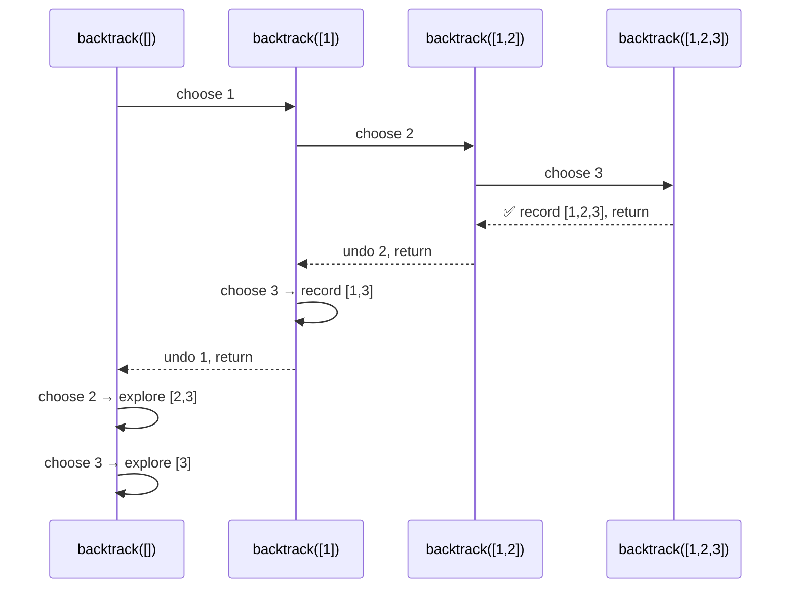

# Backtracking — Explore, Choose, Undo

## Core Idea

Backtracking systematically explores all solution paths by making a choice, recursing deeper, then **undoing** that choice before trying the next option. Think of it as DFS on the decision tree. The key insight: the stack frame *is* your state — when you return, you've already "undone" the choice.

## Template Code

```go
func backtrack(state []int, choices []int, result *[][]int) {
    if isComplete(state) {
        snapshot := make([]int, len(state))
        copy(snapshot, state)
        *result = append(*result, snapshot)
        return
    }
    for _, choice := range choices {
        if !isValid(state, choice) {
            continue
        }
        state = append(state, choice)       // choose
        backtrack(state, choices, result)    // explore
        state = state[:len(state)-1]        // undo
    }
}
```

## When To Use

- "Generate all…" / "Find all permutations/combinations/subsets"
- Constraint satisfaction (N-Queens, Sudoku)
- Any problem where you must explore **every valid path**

## Why Naive Fails

Without pruning (`isValid` check), you explore the entire decision tree — O(n!) or O(2^n). Backtracking cuts branches early. Without the **undo step**, state accumulates and produces wrong results.

## Mermaid Visualization

Subsets of `[1, 2, 3]` — stack push/pop as a sequence diagram:



> **Mental model**: Every `-->>` arrow is a stack pop. Every `->>` is a stack push. If you can draw this for any problem, you understand the recursion.
