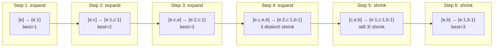

# Variable Sliding Window — Shrink Until Valid

## Core Idea

Maintain a window `[left, right]` that expands by moving `right` and **shrinks** by moving `left` when a condition is violated. The window size varies dynamically. Track window state with a map or counter. The pattern: expand → check condition → shrink from left until valid again → update answer.

## Template Code

```go
func variableWindow(s string, k int) int {
    freq := make(map[byte]int)
    left, best := 0, 0

    for right := 0; right < len(s); right++ {
        freq[s[right]]++

        // Shrink window until condition is satisfied
        for !isValid(freq, k) {
            freq[s[left]]--
            if freq[s[left]] == 0 {
                delete(freq, s[left])
            }
            left++
        }

        // Update answer with current valid window
        best = max(best, right-left+1)
    }
    return best
}
```

## When To Use

- "Longest substring with at most K distinct characters"
- "Minimum window substring containing all characters"
- "Longest subarray with sum ≤ K"
- Any problem asking for **optimal contiguous subarray/substring** with a constraint

## Why Naive Fails

Checking every `[i, j]` pair is O(n²). The sliding window keeps each element entering and leaving at most once → O(n). The critical mistake: resetting `left` to 0 on each iteration instead of keeping it monotonically increasing.

## Mermaid Visualization

Longest substring with at most 2 distinct chars in `"eceba"`:



> **Mental model**: `right` always moves forward. `left` only moves forward (never back). This is why it's O(n), not O(n²).
