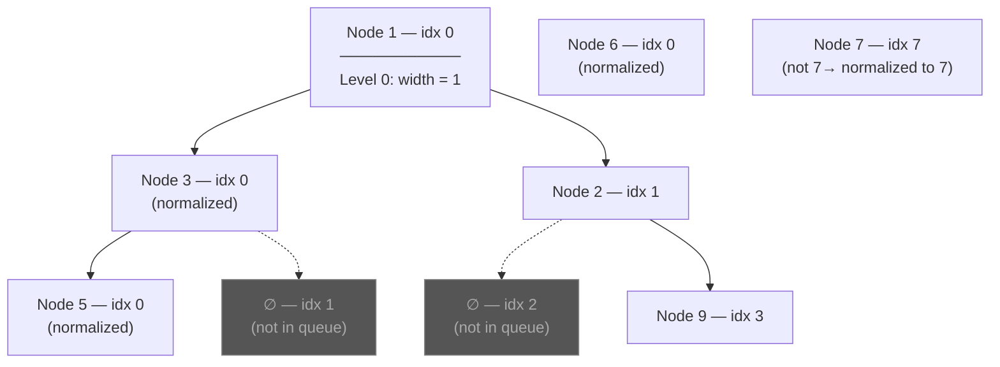

# BFS Level-Order — Index Tracking

## Core Idea

Process a tree **level by level** using a queue. Pair each node with a **positional index** (as if the tree were embedded in a complete binary tree). For any node at index `i`, its left child is at `2*i + 1` and right child at `2*i + 2`. This lets you compute **width, position, and spacing** without materializing null nodes.

**Normalize** indices per level (subtract the first node's index) to prevent integer overflow on deep, skewed trees.

## Template Code

```go
type NodeIndex struct {
    node  *TreeNode
    index int
}

func bfsWithIndex(root *TreeNode) int {
    if root == nil {
        return 0
    }

    q := []NodeIndex{{root, 0}}
    result := 0

    for len(q) > 0 {
        size := len(q)
        start := q[0].index  // first index this level

        for i := 0; i < size; i++ {
            front := q[0]
            q = q[1:]

            idx := front.index - start  // normalize to prevent overflow

            // Use idx for width / position calculations
            // ...

            if front.node.Left != nil {
                q = append(q, NodeIndex{front.node.Left, 2*idx + 1})
            }
            if front.node.Right != nil {
                q = append(q, NodeIndex{front.node.Right, 2*idx + 2})
            }
        }
    }

    return result
}
```

## When To Use

- Maximum width of binary tree
- Right/left side view of binary tree
- Find bottom-left/right value
- Level-order traversal variants
- Any problem needing **per-level** or **positional** information

## Why Naive Fails

A naive approach that stores all positions (including nulls) in an array uses **O(2ⁿ)** space for a tree of depth `n`. Index tracking achieves the same positional information in **O(w)** space where `w` is the maximum width.

Without index normalization, a left-skewed tree of depth 50+ causes index overflow even with 64-bit integers.

## Mermaid Visualization

Width calculation on tree `[1, 3, 2, 5, null, null, 9, 6, null, null, 7]`:



> **Key insight**: The width at any level = `lastIndex - firstIndex + 1`. Null gaps are implicitly counted through index arithmetic without storing them.
