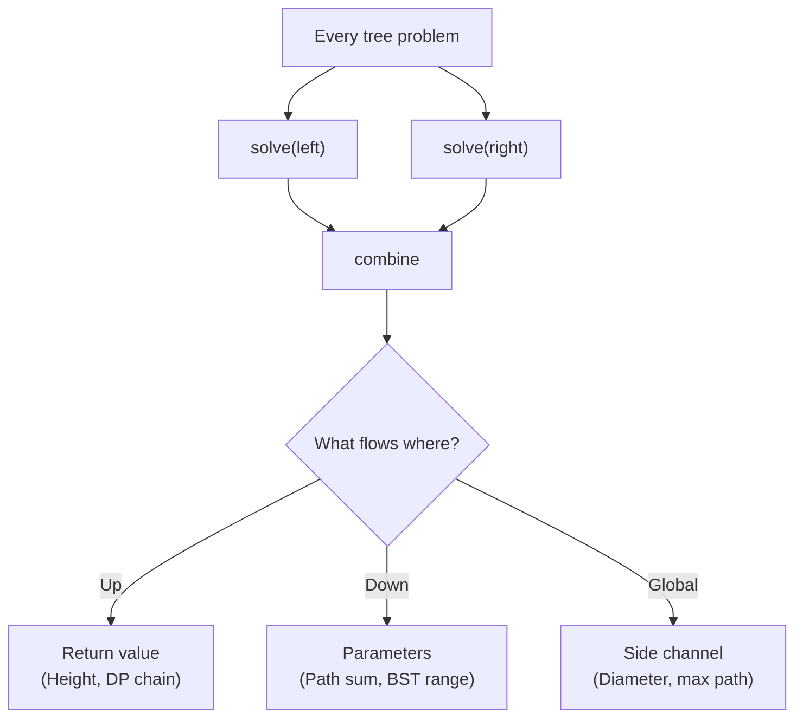

# Core Tree Concepts

> These are not patterns — these are non-negotiable fundamentals.
> If any of these are unclear, patterns will not stick.

---

## Concept 1 — Recursion Contract

You must always know:

> **What does `dfs(node)` return?**

If you don't define this before writing code, recursion breaks.

| Pattern | `dfs(node)` returns |
|---------|-------------------|
| Height | height of subtree rooted at `node` |
| Tree DP | best single-chain value upward |
| Path Tracking | nothing (void) — state flows down |
| BST Validation | boolean — is subtree valid? |
| Construction | `*TreeNode` — the built subtree root |

**Rule**: Write the return type and its meaning in one sentence before coding. If you can't, you don't understand the problem yet.

---

## Concept 2 — Base Case Semantics

The base case defines what a nil child contributes.

```go
// Height
if node == nil { return 0 }  // nil has height 0

// Path sum
if node == nil { return 0 }  // nil contributes 0 to sum

// BST validation
if node == nil { return true }  // empty tree is valid BST
```

**Wrong base cases break everything.**

| Mistake | Consequence |
|---------|-------------|
| `height(nil) = -1` instead of `0` | Off-by-one in all height calculations |
| `pathSum(nil) = math.MinInt` | Poisons valid sums up the tree |
| Forgetting `return 0` for DP | Negative chains propagate incorrectly |

**Rule**: Before coding, ask: *"What does nil contribute to this computation?"*

---

## Concept 3 — Postorder = Aggregation

Whenever a problem says:

- "combine left and right"
- "diameter"
- "longest path through node"
- "subtree property"

Your brain should immediately think:

> **POSTORDER**

```
solve(left)
solve(right)
combine ← this is the aggregation step
```

Postorder means: children are solved **before** the parent computes. This is why it works for aggregation — by the time you process a node, you already have both children's answers.

---

## Concept 4 — Parent Cannot Take Two Branches

This is the key insight behind Tree DP.

When a path goes **through** a node (using both left and right subtrees), that forked path **cannot extend upward** to the parent.

```
        parent
       /
     node      ← path forks here: left + node + right
    /    \
  left   right
```

The parent can only receive a **single chain** from `node` — not the forked path.

**That's why global variables exist in Tree DP.**

- **Global**: tracks the best forked answer (cannot be returned)
- **Return value**: tracks the best single chain (can extend upward)

If you return `left + right + node.Val` to the parent, you've created an invalid path that forks twice.

---

## Concept 5 — Trees Are Divide-and-Conquer Graphs

Every tree problem is secretly:

```
solve(left)
solve(right)
combine
```

**Always. No exceptions.**

This means:
- If you see a tree problem, you're doing divide-and-conquer
- The "divide" is the tree structure itself (left subtree, right subtree)
- The "conquer" is how you combine results

The only variation is **what flows where**:

```
Flow up   → return value (postorder)
Flow down → parameters  (preorder / top-down)
Global    → cross-node answer (when combining would break path validity)
```

If you understand these three flows, you understand all tree patterns.

---

## Quick Reference


