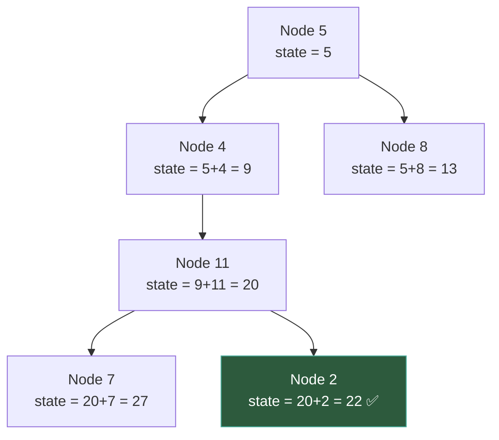

# Path Tracking — Top-Down DFS

---

## 1. Pattern Name

**Path Tracking (Top-Down DFS)**

---

## 2. One-Line Mental Model

> Information flows **from parent to child** through parameters — you carry state downward and act at leaves or along the way.

---

## 3. Recognition Signals

- "root-to-leaf path"
- "path sum"
- "path equals target"
- "validate BST" (range flows downward)
- "accumulate value along path"
- "sum of root-to-leaf numbers"
- Any problem where the **parent gives context** to the child

---

## 4. Recursion Contract

`dfs(node, state)` returns: **nothing** (or a boolean). The answer is computed at leaves or updated via the `state` parameter.

- The return value is typically `void` or `bool`
- The **parameter** carries the important information
- The answer is found when `state` satisfies a condition (usually at a leaf)

---

## 5. Global State

**Usually none.** State lives in parameters.

Exception: when collecting all valid paths into a result list:

```go
var result [][]int  // collects all root-to-leaf paths matching condition
```

---

## 6. Data Flow Diagram

```
Flow up   → nothing (or bool)
Flow down → state (sum, range, path, depth)
Global    → result collection (optional)
```



---

## 7. Template Skeleton

### Basic (void return)

```go
func dfs(node *TreeNode, state int) {
    if node == nil {
        return
    }

    state = update(state, node)

    // Check at leaf
    if node.Left == nil && node.Right == nil {
        if condition(state) {
            record(state)
        }
        return
    }

    dfs(node.Left, state)
    dfs(node.Right, state)
}
```

### Boolean return (validation)

```go
func dfs(node *TreeNode, lo, hi int) bool {
    if node == nil {
        return true
    }

    if node.Val <= lo || node.Val >= hi {
        return false
    }

    return dfs(node.Left, lo, node.Val) &&
           dfs(node.Right, node.Val, hi)
}
```

---

## 8. Minimal Working Example

**Path Sum**: Does any root-to-leaf path sum to 22?

```
        5
       / \
      4    8
     /    / \
    11   13   4
   / \         \
  7   2         1
```

| Path | Sum | Match? |
|------|-----|--------|
| 5 → 4 → 11 → 7 | 27 | No |
| 5 → 4 → 11 → 2 | **22** | **Yes** ✅ |
| 5 → 8 → 13 | 26 | No |
| 5 → 8 → 4 → 1 | 18 | No |

State at each node = cumulative sum from root:

```
dfs(5, 0)           → state = 5
  dfs(4, 5)         → state = 9
    dfs(11, 9)      → state = 20
      dfs(7, 20)    → state = 27 (leaf, ≠ 22)
      dfs(2, 20)    → state = 22 (leaf, ✅)
```

---

## 9. Failure Mode

**Trying to aggregate children's results.**

```go
// ❌ WRONG — this is bottom-up, not top-down
func dfs(node *TreeNode, target int) bool {
    left := dfs(node.Left, target)
    right := dfs(node.Right, target)
    return left || right || (node.Val == target)  // confused: mixing directions
}
```

If you're combining `left` and `right` results, you've slipped into Tree DP or Height territory.

**Another failure**: Forgetting leaf check.

```go
// ❌ WRONG — counts non-leaf nodes
if node.Val == remaining {
    return true  // but this node has children! Not a root-to-leaf path
}

// ✅ CORRECT — check only at leaves
if node.Left == nil && node.Right == nil && remaining == 0 {
    return true
}
```

---

## 10. Complexity

| | |
|---|---|
| **Time** | O(n) — visit each node once |
| **Space** | O(h) — recursion stack. O(n·h) if collecting all paths |

---

## 11. Related Problems

- Path Sum (I, II, III)
- Root to Leaf Numbers (sum of all root-to-leaf numbers)
- Validate BST (range `[lo, hi]` flows downward)
- Binary Tree Paths (collect all root-to-leaf paths)
- Smallest String Starting From Leaf
- Longest ZigZag Path

---

## 12. Pattern Variations

| Variation | State passed down |
|---|---|
| **Path Sum** | Running sum (int) |
| **BST Validation** | Valid range: `(lo, hi)` |
| **Path Collection** | Current path: `[]int` slice |
| **Depth Tracking** | Current depth: `int` |
| **String Building** | Current string prefix |

---

## 13. Edge Cases

| Case | Behavior |
|---|---|
| Empty tree | Return false / empty result |
| Single node | Root is also a leaf — check condition immediately |
| Negative values | Sum can decrease — don't prune early |
| Target = 0, all zeros | Must still trace to leaf |
| Path must reach **leaf** | Don't return true at intermediate nodes |

---

## 14. When NOT to Use This Pattern

| Situation | Use instead |
|---|---|
| Need to combine children's results | **Tree DP** or **Height** |
| Answer involves "through node" (forked) | **Tree DP** |
| Need answer for every node, not just leaves | **Rerooting DP** |
| Just visiting in order | **Traversal** |
| Path Sum III (path doesn't start at root) | **Prefix Sum + DFS** (hybrid) |

---

## Key Distinction From Tree DP

| | Path Tracking | Tree DP |
|---|---|---|
| **Direction** | Top-down (parent → child) | Bottom-up (child → parent) |
| **State lives in** | Parameters | Return value + global |
| **Answer found at** | Leaves (usually) | Every node (global update) |
| **Return value** | void / bool | Numeric chain |
| **Path starts at** | Root (usually) | Anywhere |
