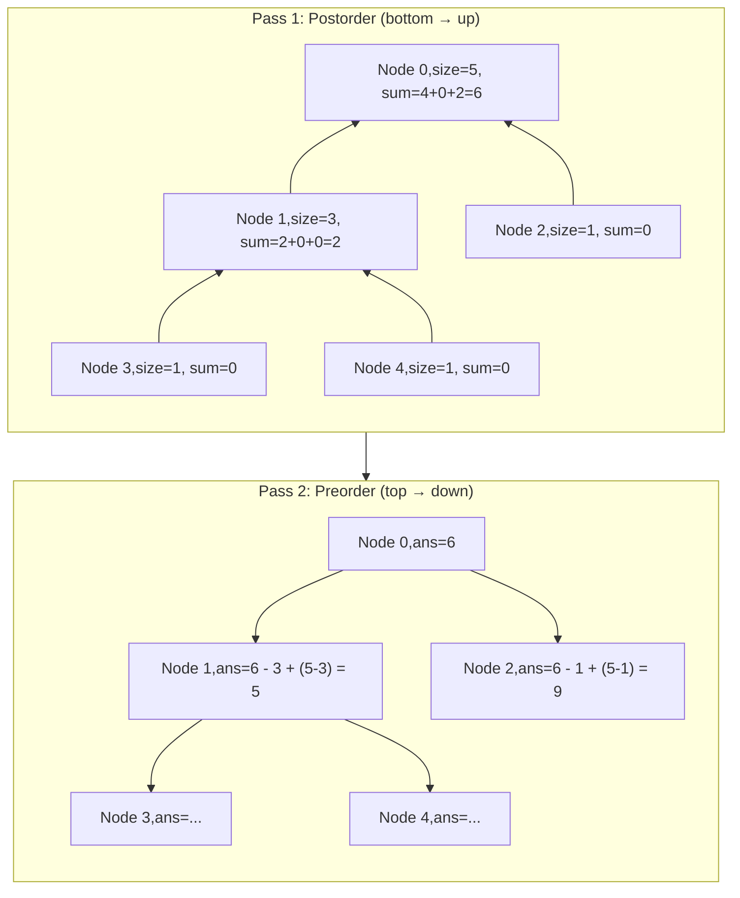

# Rerooting DP — Advanced Tree DP

---

## 1. Pattern Name

**Rerooting DP (Two-Pass Tree DP)**

---

## 2. One-Line Mental Model

> Compute the answer for **every node** as if it were the root — first gather subtree info going up (postorder), then propagate parent info going down (preorder).

---

## 3. Recognition Signals

- "distance from every node"
- "answer for **each** node"
- "sum of distances to all other nodes"
- "minimum distance in a tree"
- "subtree + outside subtree"
- Any problem where the answer at node X depends on **both** its subtree and the rest of the tree

---

## 4. Recursion Contract

**Two passes, two contracts:**

| Pass | Direction | `dfs(node)` returns |
|------|-----------|-------------------|
| Pass 1 (postorder) | Bottom-up | Subtree aggregate (size, sum, etc.) |
| Pass 2 (preorder) | Top-down | Nothing — fills answer array using parent info |

---

## 5. Global State

```go
subtreeSize []int   // from pass 1: size of subtree rooted at each node
subtreeSum  []int   // from pass 1: answer considering only subtree
answer      []int   // final answer for each node (filled in pass 2)
```

**Why two passes?** With standard Tree DP, you can compute the answer for the root. But to compute it for every other node, you need to know what's **outside** each node's subtree — that info comes from the parent, which requires a second pass.

---

## 6. Data Flow Diagram

```
Pass 1 (postorder):
  Flow up   → subtree size, subtree sum
  Flow down → nothing
  Global    → subtreeSize[], subtreeSum[]

Pass 2 (preorder):
  Flow up   → nothing
  Flow down → parent's outside contribution
  Global    → answer[]
```



---

## 7. Template Skeleton

### Generic Rerooting Structure

```go
var (
    adj         [][]int
    subtreeSize []int
    subtreeDP   []int
    answer      []int
)

// Pass 1: Postorder — compute subtree info
func postorder(node, parent int) {
    subtreeSize[node] = 1
    subtreeDP[node] = 0

    for _, child := range adj[node] {
        if child == parent {
            continue
        }
        postorder(child, node)

        subtreeSize[node] += subtreeSize[child]
        subtreeDP[node] += subtreeDP[child] + subtreeSize[child]
    }
}

// Pass 2: Preorder — propagate parent info
func preorder(node, parent int, n int) {
    for _, child := range adj[node] {
        if child == parent {
            continue
        }

        // Reroot: move root from node to child
        // child's subtree contribution stays
        // everything else shifts by (n - subtreeSize[child]) - subtreeSize[child]
        answer[child] = answer[node] - subtreeSize[child] + (n - subtreeSize[child])

        preorder(child, node, n)
    }
}

func solve(n int) []int {
    answer = make([]int, n)
    subtreeSize = make([]int, n)
    subtreeDP = make([]int, n)

    postorder(0, -1)
    answer[0] = subtreeDP[0]
    preorder(0, -1, n)

    return answer
}
```

---

## 8. Minimal Working Example

**Sum of Distances in Tree** — tree with 6 nodes:

```
    0
   / \
  1   2
 /|\
3  4  5
```

**Pass 1 (postorder)** — compute from leaves up:

| Node | subtreeSize | subtreeDP | How |
|------|-------------|-----------|-----|
| 3 | 1 | 0 | leaf |
| 4 | 1 | 0 | leaf |
| 5 | 1 | 0 | leaf |
| 1 | 4 | 0+1 + 0+1 + 0+1 = **3** | 3 children, each at distance 1 |
| 2 | 1 | 0 | leaf |
| 0 | 6 | 3+4 + 0+1 = **8** | subtreeDP[1]+size[1] + subtreeDP[2]+size[2] |

`answer[0] = 8` (distances from 0: 1+2+2+2+1 = 8)

**Pass 2 (preorder)** — reroot from parent to child:

| Node | answer | Formula |
|------|--------|---------|
| 0 | **8** | from pass 1 |
| 1 | 8 − 4 + (6−4) = **6** | moving root to 1: 4 nodes get closer, 2 get farther |
| 2 | 8 − 1 + (6−1) = **12** | moving root to 2: 1 node closer, 5 farther |
| 3 | 6 − 1 + (6−1) = **10** | from node 1's answer |
| 4 | 6 − 1 + (6−1) = **10** | from node 1's answer |
| 5 | 6 − 1 + (6−1) = **10** | from node 1's answer |

---

## 9. Failure Mode

### Trying to solve with single-pass DP

```go
// ❌ WRONG — only computes answer for root
func dfs(node, parent int) int {
    sum := 0
    for _, child := range adj[node] {
        if child != parent {
            sum += dfs(child, node) + subtreeSize[child]
        }
    }
    return sum
}
// This gives correct answer ONLY for the root
```

To get answers for all nodes, you must do the second (preorder) pass to propagate the "outside" contribution.

### Wrong rerooting formula

```go
// ❌ WRONG — forgetting that some nodes get farther
answer[child] = answer[node] - subtreeSize[child]
// Missing: + (n - subtreeSize[child])

// ✅ CORRECT
answer[child] = answer[node] - subtreeSize[child] + (n - subtreeSize[child])
```

When you reroot from `node` to `child`:
- `subtreeSize[child]` nodes get **1 closer** (they're now in child's subtree)
- `n - subtreeSize[child]` nodes get **1 farther** (they're outside)

---

## 10. Complexity

| | |
|---|---|
| **Time** | O(n) — two passes, each visiting every node once |
| **Space** | O(n) — arrays for subtree info + answer |

---

## 11. Related Problems

- Sum of Distances in Tree (LC 834)
- Count Nodes With the Highest Score (LC 2049)
- Minimum Edge Reversals (LC 2858)
- Sum of Distances in Unrooted Tree
- Tree Distance queries

---

## 12. Pattern Variations

| Variation | Pass 1 computes | Pass 2 propagates |
|---|---|---|
| **Sum of distances** | Subtree size + subtree distance sum | Shift distances by ±1 per node |
| **Min distance** | Subtree height | Parent's min from outside |
| **Count-based** | Subtree count of special nodes | Complement count |

### Key Insight Across All Variations

The rerooting formula always follows:

```
answer[child] = transform(answer[parent], subtreeInfo[child], n)
```

Where `transform` accounts for nodes moving closer vs farther.

---

## 13. Edge Cases

| Case | Behavior |
|---|---|
| Single node | answer = [0] |
| Linear chain (path graph) | Both passes degenerate to O(n), still works |
| Star graph (1 center, n−1 leaves) | All leaves have same answer |
| Already rooted tree | Still need to conceptually reroot |

---

## 14. When NOT to Use This Pattern

| Situation | Use instead |
|---|---|
| Only need answer for root | **Tree DP** — single postorder pass |
| Info flows only one direction | **Path Tracking** or **Tree Height** |
| Building a tree | **Tree Construction** |
| Problem is about paths, not distance sums | **Tree DP** |
| Tree is binary with clear structure | Usually simpler patterns suffice |

---

## Why This Is Hard

Rerooting DP is hard because it requires thinking about two complementary perspectives simultaneously:

1. **What my subtree contributes** (standard Tree DP — comfortable)
2. **What everything outside my subtree contributes** (requires inversion of perspective)

The second perspective is what most people can't intuit. The trick: when you move the root from parent to child, you already know the parent's full answer. You just need to adjust for the shift.

```
parent's answer = subtree contribution + outside contribution
child's answer  = child's subtree (stays) + new outside (derived from parent)
```

**Practice tip**: Always solve for the root first (standard Tree DP), then ask: *"How does the answer change when I move the root one edge?"*
