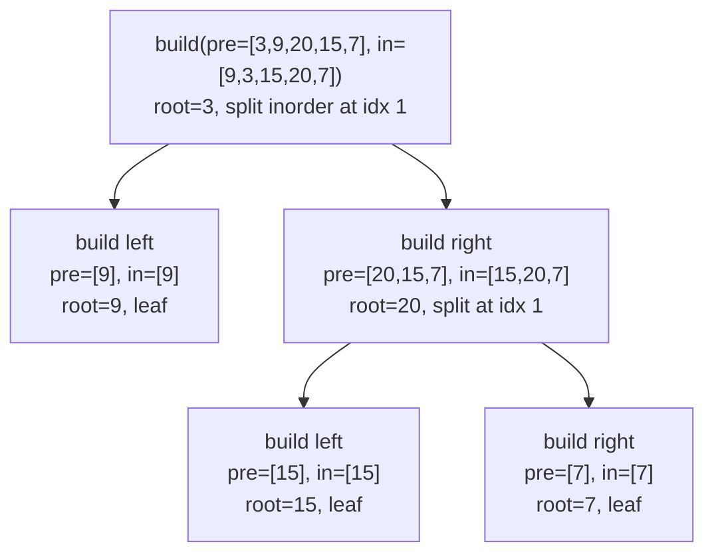

# Tree Construction — Split by Root

---

## 1. Pattern Name

**Tree Construction — Split by Root**

---

## 2. One-Line Mental Model

> The root splits the problem into left and right subtrees via **subarray boundaries** — recursion builds structure instead of computing values.

---

## 3. Recognition Signals

- "construct binary tree from preorder and inorder"
- "construct binary tree from inorder and postorder"
- "convert sorted array to BST"
- "serialize / deserialize" (construction half)
- "build BST from preorder"
- Given two traversal orders → build the tree

---

## 4. Recursion Contract

`build(...)` returns: **`*TreeNode`** — the root of the subtree built from the given range.

- Parameters define the subarray boundaries
- Each call creates one node and recursively builds left and right
- Base case: invalid range → return `nil`

---

## 5. Global State

**Hashmap** for O(1) index lookup in inorder array:

```go
inorderIndex := map[int]int{}  // value → index in inorder
```

Without this, finding the root in inorder is O(n) per call → O(n²) total.

---

## 6. Data Flow Diagram

```
Flow up   → *TreeNode (built subtree)
Flow down → array boundaries (indices)
Global    → inorder index map (optimization)
```



---

## 7. Template Skeleton

### From Preorder + Inorder

```go
var inorderIdx map[int]int

func build(preorder []int, preStart int, inorder []int, inStart, inEnd int) *TreeNode {
    if inStart > inEnd {
        return nil
    }

    rootVal := preorder[preStart]
    root := &TreeNode{Val: rootVal}

    mid := inorderIdx[rootVal]           // root's position in inorder
    leftSize := mid - inStart            // number of nodes in left subtree

    root.Left = build(preorder, preStart+1, inorder, inStart, mid-1)
    root.Right = build(preorder, preStart+1+leftSize, inorder, mid+1, inEnd)

    return root
}
```

### Sorted Array → BST

```go
func build(nums []int, lo, hi int) *TreeNode {
    if lo > hi {
        return nil
    }

    mid := lo + (hi-lo)/2
    root := &TreeNode{Val: nums[mid]}
    root.Left = build(nums, lo, mid-1)
    root.Right = build(nums, mid+1, hi)

    return root
}
```

---

## 8. Minimal Working Example

**Build from Preorder `[3, 9, 20, 15, 7]` + Inorder `[9, 3, 15, 20, 7]`**

```
Step 1: root = preorder[0] = 3
        Find 3 in inorder at index 1
        Left inorder:  [9]        (indices 0..0)
        Right inorder: [15,20,7]  (indices 2..4)
        Left size = 1

Step 2: Left subtree
        root = preorder[1] = 9
        Inorder [9] — leaf node

Step 3: Right subtree
        root = preorder[2] = 20
        Find 20 in inorder at index 3
        Left inorder:  [15]  → leaf
        Right inorder: [7]   → leaf
```

Result:

```
      3
     / \
    9   20
       / \
      15   7
```

---

## 9. Failure Mode

### Creating new slices instead of using indices

```go
// ❌ WRONG — O(n) copy per call → O(n²) total
leftInorder := inorder[:mid]
rightInorder := inorder[mid+1:]

// ✅ CORRECT — O(1) per call
root.Left = build(preorder, preStart+1, inorder, inStart, mid-1)
```

### Linear search for root in inorder

```go
// ❌ WRONG — O(n) per call → O(n²) total
for i, v := range inorder {
    if v == rootVal { mid = i; break }
}

// ✅ CORRECT — O(1) lookup
mid := inorderIdx[rootVal]  // precomputed hashmap
```

### Wrong preorder index for right subtree

```go
// ❌ WRONG — off by one
root.Right = build(preorder, preStart+2, ...)

// ✅ CORRECT — skip root + entire left subtree
root.Right = build(preorder, preStart+1+leftSize, ...)
```

---

## 10. Complexity

| | |
|---|---|
| **Time** | O(n) with hashmap, O(n²) without |
| **Space** | O(n) — hashmap + O(h) recursion stack |

---

## 11. Related Problems

- Construct Binary Tree from Preorder and Inorder (LC 105)
- Construct Binary Tree from Inorder and Postorder (LC 106)
- Convert Sorted Array to BST (LC 108)
- Convert Sorted List to BST (LC 109)
- Construct BST from Preorder (LC 1008)
- Serialize and Deserialize Binary Tree (LC 297)

---

## 12. Pattern Variations

| Variation | Key Difference |
|---|---|
| **Preorder + Inorder** | Root = first element of preorder |
| **Postorder + Inorder** | Root = last element of postorder, build right-to-left |
| **Sorted Array → BST** | Mid element = root, no lookup needed |
| **Sorted List → BST** | Use slow/fast pointer for mid, or count-based |
| **BST from Preorder only** | Use upper-bound constraint: `build(preorder, &idx, bound)` |

### Postorder variant — right subtree first

```go
// Postorder: left → right → root
// Process from end: root → right → left
root.Right = build(...)  // build right FIRST
root.Left = build(...)   // then left
```

---

## 13. Edge Cases

| Case | Behavior |
|---|---|
| Empty arrays | Return `nil` |
| Single element | Return leaf node |
| All left children (skewed) | Recursion depth = n |
| Duplicate values | Hashmap breaks — problem guarantees unique values |
| Sorted array of even length | Two valid BSTs (left-leaning or right-leaning mid) |

---

## 14. When NOT to Use This Pattern

| Situation | Use instead |
|---|---|
| Not building a tree — computing values | **Tree DP** or **Height** |
| Modifying existing tree structure | **Traversal** with mutation |
| Given a tree, find something | Any other pattern |
| "Serialize" (encoding half) | **Traversal** (preorder DFS) |
