# Tree Pattern Decision Map

> Use this **before** coding. Read the problem statement, then walk this flowchart.

---

## Decision Flowchart

```mermaid
flowchart TD
    START["Read the problem"] --> Q1{"Does the problem ask\nto BUILD a tree?"}
    
    Q1 -->|Yes| P2["🔨 Tree Construction\ntree-construction.md"]
    Q1 -->|No| Q2{"Is it just visiting/collecting\nnodes in some order?"}
    
    Q2 -->|Yes| P1["🔄 Traversal\ntraversal.md"]
    Q2 -->|No| Q3{"Does each node return\nONE numeric value upward?"}
    
    Q3 -->|Yes, simple| Q4{"Does node combine\nleft + right into a\nglobal answer?"}
    Q3 -->|No| Q5{"Does info flow\nparent → child?"}
    
    Q4 -->|No| P3["📏 Tree Height\ntree-height.md"]
    Q4 -->|Yes| P4["🧮 Tree DP\ntree-dp.md"]
    
    Q5 -->|Yes| P5["⬇️ Path Tracking\npath-tracking.md"]
    Q5 -->|No| Q6{"Does the problem need\nan answer for EVERY node?"}
    
    Q6 -->|Yes| P6["🔄 Rerooting DP\nrerooting-dp.md"]
    Q6 -->|No| P4
```

---

## Quick Decision Table

| Signal in Problem | Pattern | File |
|---|---|---|
| "build tree from traversal" | Tree Construction | `tree-construction.md` |
| "visit", "print", "serialize", "collect" | Traversal | `traversal.md` |
| "height", "depth", "balanced", "min depth" | Tree Height | `tree-height.md` |
| "diameter", "max path sum", "longest path" | Tree DP | `tree-dp.md` |
| "root-to-leaf", "path sum", "validate BST" | Path Tracking | `path-tracking.md` |
| "distance from every node", "answer for each node" | Rerooting DP | `rerooting-dp.md` |

---

## The Two Questions That Matter Most

Before coding any tree problem, answer:

### 1. What does `dfs(node)` return?

If you can't answer this in one sentence, you haven't understood the problem.

### 2. Where does the answer live?

| Answer location | Pattern family |
|---|---|
| **In the return value** | Height, Construction, Traversal |
| **In a global variable** | Tree DP |
| **In the parameters** | Path Tracking |
| **Both return + parameters** | Rerooting DP |

---

## Common Traps

| Trap | What actually happens |
|---|---|
| "Looks like Height" but has "through node" | It's **Tree DP**, not Height |
| "Looks like Tree DP" but info flows downward | It's **Path Tracking** |
| "Need answer for root" vs "for every node" | Root only → Tree DP / Height. Every node → **Rerooting DP** |
| "Build tree" confused with "modify tree" | Building → Construction. Modifying → usually Traversal + mutation |
