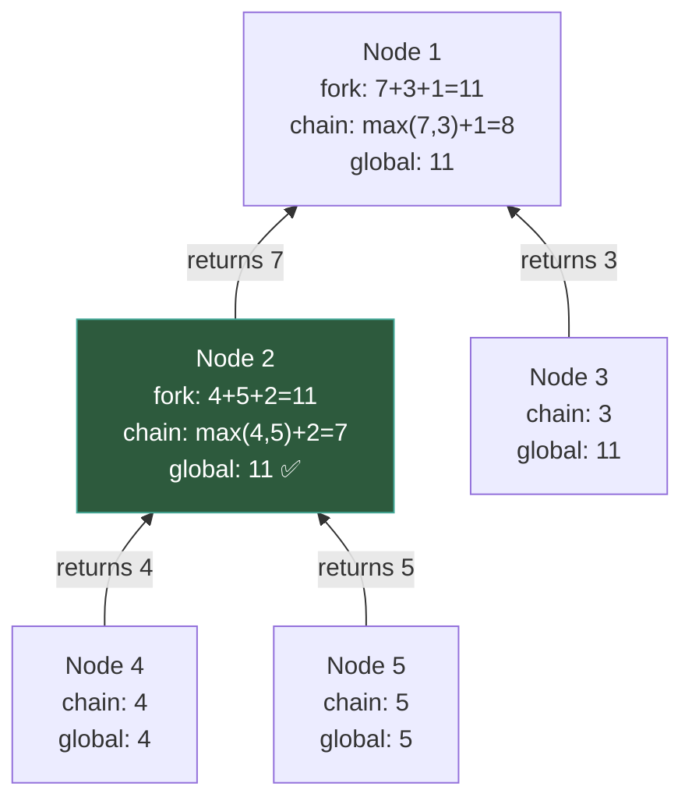

# Tree DP — Postorder Accumulation

---

## 1. Pattern Name

**Tree DP — Postorder Accumulation**

---

## 2. One-Line Mental Model

> Each node aggregates results from children, updates a **global forked answer**, and returns a **single chain upward** — because paths cannot fork twice.

---

## 3. Recognition Signals

- "path" (especially "path sum")
- "diameter"
- "through node"
- "combine left and right"
- "longest path"
- "subtree aggregation with global"
- Any problem where the best answer **passes through a node** using both subtrees

---

## 4. Recursion Contract

`dfs(node)` returns: **the best single-chain value** extending upward from this node.

- This is NOT the final answer
- This is the value the parent can use to extend its own path
- The final answer lives in the **global variable**

---

## 5. Global State

**`globalMax`** — tracks the best forked answer seen so far.

**Why can't it be returned?** Because the forked answer (left + right + node) uses both subtrees. The parent can only extend through **one** child. If you returned the forked value, the parent would create an invalid path that forks at two different nodes.

---

## 6. Data Flow Diagram

```
Flow up   → best single chain (return value)
Flow down → nothing
Global    → best forked answer (cross-node)
```



---

## 7. Template Skeleton

```go
var global int

func dfs(node *TreeNode) int {
    if node == nil {
        return 0
    }

    left := dfs(node.Left)
    right := dfs(node.Right)

    // GLOBAL: forked answer through this node
    global = max(global, combineForGlobal(left, right, node))

    // RETURN: single chain upward
    return chainForParent(left, right, node)
}
```

### Max Path Sum variant

```go
var globalMax int

func dfs(node *TreeNode) int {
    if node == nil {
        return 0
    }

    left := max(0, dfs(node.Left))    // clamp negative
    right := max(0, dfs(node.Right))  // clamp negative

    globalMax = max(globalMax, left+right+node.Val)

    return max(left, right) + node.Val
}
```

### Diameter variant

```go
var globalDiameter int

func dfs(node *TreeNode) int {
    if node == nil {
        return 0
    }

    left := dfs(node.Left)
    right := dfs(node.Right)

    globalDiameter = max(globalDiameter, left+right)

    return max(left, right) + 1
}
```

---

## 8. Minimal Working Example

**Max Path Sum** on tree `[1, 2, 3, 4, 5]`:

```
        1
       / \
      2    3
     / \
    4   5
```

| Node | Left | Right | Global Update | Returns |
|------|------|-------|---------------|---------|
| 4 | 0 | 0 | max(−∞, 0+0+4) = **4** | max(0,0)+4 = **4** |
| 5 | 0 | 0 | max(4, 0+0+5) = **5** | max(0,0)+5 = **5** |
| 2 | 4 | 5 | max(5, 4+5+2) = **11** | max(4,5)+2 = **7** |
| 3 | 0 | 0 | max(11, 0+0+3) = **11** | max(0,0)+3 = **3** |
| 1 | 7 | 3 | max(11, 7+3+1) = **11** | max(7,3)+1 = **8** |

**Final answer**: `globalMax = 11` (path: 4→2→5)

> **Key insight**: Node 2 returns **7** to its parent but the global answer is **11**. The return value ≠ the answer.

---

## 9. Failure Mode

### Returning the forked path

```go
// ❌ WRONG
return left + right + node.Val
```

This returns the forked answer to the parent. The parent then adds another branch, creating a path that forks at two nodes — which is invalid.

### Forgetting to clamp negatives

```go
// ❌ WRONG — negative subtree poisons the chain
left := dfs(node.Left)  // returns -5
return max(left, right) + node.Val

// ✅ CORRECT
left := max(0, dfs(node.Left))  // don't take negative subtree
```

### Forgetting global reset

```go
// ❌ WRONG — stale global from previous test case
var globalMax int
func maxPathSum(root *TreeNode) int {
    dfs(root)
    return globalMax
}

// ✅ CORRECT
func maxPathSum(root *TreeNode) int {
    globalMax = math.MinInt32
    dfs(root)
    return globalMax
}
```

---

## 10. Complexity

| | |
|---|---|
| **Time** | O(n) — visit each node once |
| **Space** | O(h) — recursion stack |

---

## 11. Related Problems

- Diameter of Binary Tree
- Binary Tree Maximum Path Sum
- Longest Univalue Path
- Longest ZigZag Path in Binary Tree
- Maximum Difference Between Node and Ancestor
- House Robber III

---

## 12. Pattern Variations

| Variation | Global | Return |
|---|---|---|
| **Diameter** (edges) | `left + right` | `max(left, right) + 1` |
| **Max path sum** (values) | `left + right + node.Val` | `max(left, right) + node.Val` |
| **Longest univalue** | `left + right` (if matching) | `max(left, right) + 1` (if matching) |
| **Numeric → Boolean** | `allValid && left && right` | `subtreeValid` |
| **Max → Min** | `min(global, ...)` | Same structure |

### The Core Mutation

The structure is always identical. Only two things change:

1. **What you combine** for the global update
2. **What condition** gates the combination (e.g., same value for univalue)

---

## 13. Edge Cases

| Case | Behavior |
|---|---|
| Empty tree | Return 0, global stays at initial |
| Single node | Global = node.Val, return = node.Val |
| All negative values | Must initialize global to `math.MinInt32`, not `0` |
| Skewed tree (linked list) | Fork never helps — chain IS the answer |
| All same values | Univalue path = entire tree |

---

## 14. When NOT to Use This Pattern

| Situation | Use instead |
|---|---|
| Just need height/depth | **Tree Height** — no global needed |
| Info flows parent → child | **Path Tracking** |
| Need answer for every node | **Rerooting DP** |
| Pure traversal / visiting | **Traversal** |
| Building a tree | **Tree Construction** |

---

## How This Differs from Tree Height

| | Tree DP | Height |
|---|---|---|
| **Global state** | **Yes** — tracks forked answer | None |
| **Return value** | Chain (not the answer) | **The answer itself** |
| **`left + right`** | Used in global update | Never used |
| **Keyword** | "diameter", "path sum" | "height", "depth", "balanced" |
| **Why different** | Forked paths can't extend upward | No forking — just measure depth |

**The litmus test**: Does the problem need `left + right` anywhere? If yes → Tree DP. If no → Height.
