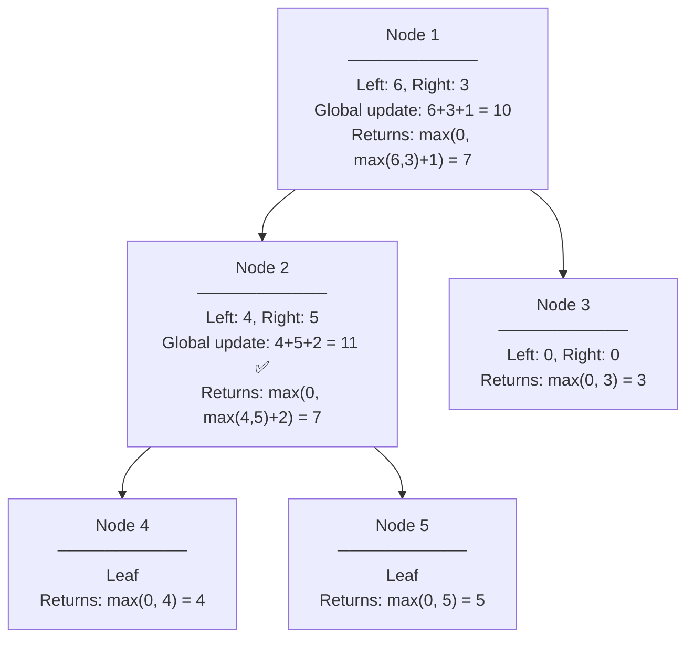

# Tree DP — Postorder Accumulation

## Core Idea

Compute answers **bottom-up**: each node receives results from its children (postorder), combines them, and returns a value to its parent. Separately, track a **global** answer updated at each node. The three questions: **What flows up?** (return value to parent) **What flows down?** (parameters from parent) **What is global?** (best answer so far)

## Template Code

```go
var globalMax int

func treeDFS(node *TreeNode) int {
    if node == nil {
        return 0
    }
    left := treeDFS(node.Left)
    right := treeDFS(node.Right)

    // Update global with "through this node" answer
    globalMax = max(globalMax, left+right+node.Val)

    // Return "up to this node" answer to parent
    return max(0, max(left, right)+node.Val)
}
```

## When To Use

- Max/min path sum in tree
- Diameter of binary tree
- Longest path with same values
- Any problem where the **best answer passes through a node** but you **return a chain upward**

## Why Naive Fails

If you return the "through node" value (both subtrees), the parent can't form a valid path — paths can't fork twice. You must return only the **best single chain** upward while updating a separate global for the "forked" answer.

## Mermaid Visualization

Max Path Sum on tree `[1, 2, 3, 4, 5]`:



> **Key insight**: The return value (chain) ≠ the global update (fork). Node 2 returns 7 to its parent but updates global with 11.
