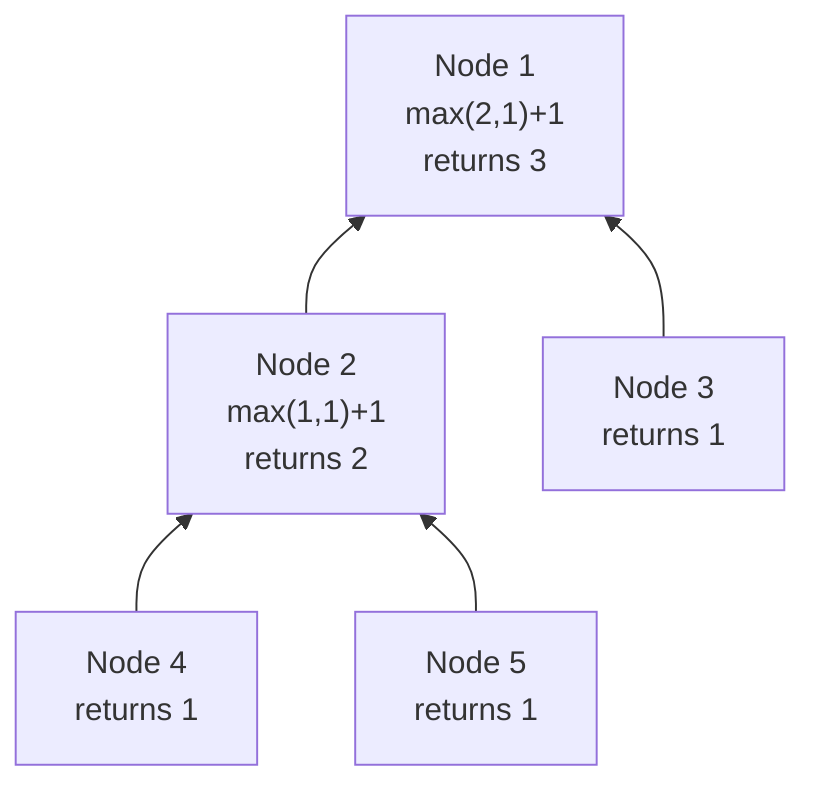

# Tree Height / Balanced — Height Aggregation

---

## 1. Pattern Name

**Tree Height Aggregation**

---

## 2. One-Line Mental Model

> Each node returns **one numeric value** upward — the height of its subtree — with no global state needed.

---

## 3. Recognition Signals

- "height of tree"
- "depth of tree"
- "balanced binary tree"
- "minimum depth"
- "maximum depth"
- "level of deepest leaf"
- Any problem where each node needs **one number** from its children and returns **one number** to its parent

---

## 4. Recursion Contract

`dfs(node)` returns: **the height of the subtree rooted at `node`**.

- `dfs(nil)` → `0` (nil has height 0)
- `dfs(leaf)` → `1` (leaf has height 1)
- `dfs(node)` → `max(left, right) + 1`

---

## 5. Global State

**None.** This is the key difference from Tree DP.

The answer lives entirely in the return value. No side channels needed because paths don't fork — you're just measuring depth.

---

## 6. Data Flow Diagram

```
Flow up   → height (return value)
Flow down → nothing
Global    → nothing
```



---

## 7. Template Skeleton

```go
func dfs(node *TreeNode) int {
    if node == nil {
        return 0
    }

    left := dfs(node.Left)
    right := dfs(node.Right)

    return max(left, right) + 1
}
```

### Balanced Variant

```go
func dfs(node *TreeNode) int {
    if node == nil {
        return 0
    }

    left := dfs(node.Left)
    right := dfs(node.Right)

    if left == -1 || right == -1 || abs(left-right) > 1 {
        return -1  // signal: unbalanced
    }

    return max(left, right) + 1
}
// Tree is balanced if dfs(root) != -1
```

---

## 8. Minimal Working Example

Tree: `[1, 2, 3, 4, 5]`

```
        1
       / \
      2   3
     / \
    4   5
```

| Node | Left | Right | Returns |
|------|------|-------|---------|
| 4 | 0 | 0 | max(0,0)+1 = **1** |
| 5 | 0 | 0 | max(0,0)+1 = **1** |
| 2 | 1 | 1 | max(1,1)+1 = **2** |
| 3 | 0 | 0 | max(0,0)+1 = **1** |
| 1 | 2 | 1 | max(2,1)+1 = **3** |

Final answer: **3**

---

## 9. Failure Mode

**Trying to use this pattern when the problem requires a global answer.**

```go
// ❌ WRONG — "diameter" is NOT a height problem
func diameter(node *TreeNode) int {
    left := diameter(node.Left)
    right := diameter(node.Right)
    return max(left, right) + 1  // this gives height, not diameter
}
```

Diameter requires `left + right` at each node (a forked answer) plus returning a chain upward. That's **Tree DP**, not Height.

**Telltale sign you're in the wrong pattern**: You feel the urge to add a global variable. If you need one, switch to Tree DP.

---

## 10. Complexity

| | |
|---|---|
| **Time** | O(n) — visit each node once |
| **Space** | O(h) — recursion stack depth |

---

## 11. Related Problems

- Maximum Depth of Binary Tree
- Minimum Depth of Binary Tree
- Balanced Binary Tree
- Maximum Depth of N-ary Tree
- Count Complete Tree Nodes (uses height)
- Subtree of Another Tree (compare heights as optimization)

---

## 12. Pattern Variations

| Variation | Change |
|---|---|
| **Max height** | `max(left, right) + 1` |
| **Min depth** | `min(left, right) + 1` — but handle single-child nodes! |
| **Balanced check** | Return `-1` sentinel for unbalanced |
| **Count nodes** | `left + right + 1` instead of max |
| **Subtree size** | Same structure, different aggregation |

**Min depth trap**: If a node has only one child, the other side returns 0 — but that's not a valid leaf path. Must special-case:

```go
if left == 0 { return right + 1 }
if right == 0 { return left + 1 }
return min(left, right) + 1
```

---

## 13. Edge Cases

| Case | Behavior |
|---|---|
| Empty tree (`nil`) | Return 0 |
| Single node | Return 1 |
| Skewed tree (all left) | Height = n, space = O(n) |
| Complete binary tree | Height = log(n) |

---

## 14. When NOT to Use This Pattern

| Situation | Use instead |
|---|---|
| Need `left + right` at each node | **Tree DP** |
| Need global variable for answer | **Tree DP** |
| Info flows from parent to child | **Path Tracking** |
| Problem says "path" or "diameter" | **Tree DP** |
| Problem says "for every node" | **Rerooting DP** |

---

## How This Differs from Tree DP

This is the most common source of confusion.

| | Height | Tree DP |
|---|---|---|
| **Global state** | None | Yes — tracks forked answer |
| **Return value is** | The final answer | A chain (not the final answer) |
| **Combine** | `max(left, right) + 1` | Global: `left + right`. Return: `max(left, right) + 1` |
| **Fork** | No forking — just pick best child | Fork at each node, but can't return it |
| **Typical keyword** | "height", "depth", "balanced" | "diameter", "path sum", "through node" |

**Rule of thumb**: If `max(left, right) + 1` is the complete answer, use Height. If you also need `left + right` somewhere, use Tree DP.
