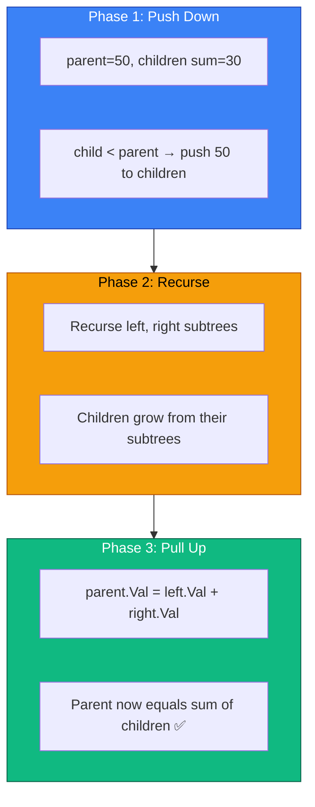

# Tree Modification — Push Down, Pull Up

---

## 1. Pattern Name

**Tree Modification — Push Down, Pull Up**

---

## 2. One-Line Mental Model

> **Push** parent's value **down** to children (so they never decrease), **recurse**, then **pull up** the children's final values to set the parent — guaranteeing every node equals the sum of its children.

---

## 3. Recognition Signals

- "convert tree so that every node value equals sum of children"
- "modify node values in-place"
- "increase values only" (values can only go up, never down)
- "children sum property"
- Any problem where you need to **redistribute** values in a tree while maintaining a constraint

---

## 4. Recursion Contract

`modify(node)` does NOT return anything — it **mutates** the tree in place.

Three phases per node:
1. **Compare** — Is current node ≥ sum of children?
2. **Push down** — If not, overwrite children with parent's value (ensures enough "budget")
3. **Pull up** — After recursion, set `node.Val = left.Val + right.Val`

---

## 5. Why Push Down Before Recursion?

The key insight is **we can only increase values, never decrease**. If a parent's value exceeds its children's sum, we need to distribute "extra budget" downward before recursing. After recursion, the children may have grown (from their own subtrees pushing up), so we pull their final values back up.

```
Before push-down:     After push-down:      After pull-up:
     50                    50                    70
    / \                   / \                   / \
   20  30                50  50                35  35
  / \                   / \                   / \
 5   10                5   10                5   30
```

Without pushing 50 down to children first, we'd lose the "extra" value that needs to be preserved somewhere in the subtree.

---

## 6. Data Flow Diagram

```
Phase 1 (Preorder)  → Push value DOWN to children if needed
Phase 2 (Recurse)   → Process subtrees (they may grow)
Phase 3 (Postorder) → Pull children's final values UP to parent
```



---

## 7. Template Skeleton

```go
func modify(node *TreeNode) {
    if node == nil {
        return
    }

    // Phase 1: Compare and push down
    childSum := 0
    if node.Left != nil  { childSum += node.Left.Val }
    if node.Right != nil { childSum += node.Right.Val }

    if childSum >= node.Val {
        node.Val = childSum              // children already big enough → take their sum
    } else {
        // Push parent's value down to children (distribute budget)
        if node.Left != nil  { node.Left.Val = node.Val }
        if node.Right != nil { node.Right.Val = node.Val }
    }

    // Phase 2: Recurse
    modify(node.Left)
    modify(node.Right)

    // Phase 3: Pull up — set node to sum of children's FINAL values
    total := 0
    if node.Left != nil  { total += node.Left.Val }
    if node.Right != nil { total += node.Right.Val }
    if node.Left != nil || node.Right != nil {
        node.Val = total
    }
}
```

---

## 8. Minimal Working Example

**Input tree**: `[2, 35, 10, 2, 3, 5, 2]`

```
        2
       / \
     35   10
    / \   / \
   2   3 5   2
```

**After transformation**:

```
        69
       / \
     55   14
    / \   / \
  35  20  9   5
```

| Node (original) | Phase 1 (Push) | After Recurse | Phase 3 (Pull Up) |
|------|------|------|------|
| 2 (leaf) | — | stays 2 | 2 → becomes 35 (pushed) → stays 35 |
| 3 (leaf) | — | stays 3 | 3 → becomes 35 (pushed) → stays 20 |
| 35 | childSum=5 < 35, push 35 to children | children grow | 35+20 = **55** |
| 5 (leaf) | — | stays 5 | 5 → becomes 10 (pushed) → stays 9 |
| 2 (leaf) | — | stays 2 | 2 → becomes 10 (pushed) → stays 5 |
| 10 | childSum=7 < 10, push 10 to children | children grow | 9+5 = **14** |
| 2 (root) | childSum=45 ≥ 2, set to 45 | children grow | 55+14 = **69** |

---

## 9. Failure Mode

### Forgetting to push down

```go
// ❌ WRONG — just pull up without pushing down
func modify(node *TreeNode) {
    modify(node.Left)
    modify(node.Right)
    node.Val = left.Val + right.Val  // value decreases! violated
}
```

If parent = 50 and children sum = 30, pulling up gives parent = 30, which **decreased** the value. We need push-down to preserve the budget.

### Pushing down but not pulling up

```go
// ❌ WRONG — push down but forget postorder fix
if childSum < node.Val {
    node.Left.Val = node.Val
    node.Right.Val = node.Val
}
modify(node.Left)
modify(node.Right)
// forgot to set node.Val = left.Val + right.Val
```

---

## 10. Complexity

| | |
|---|---|
| **Time** | O(n) — visit each node once |
| **Space** | O(h) — recursion stack |

---

## 11. Related Problems

- Children Sum Property (Coding Ninjas)
- Convert BST to Greater Tree (LC 538) — different modification pattern
- Distribute Coins in Binary Tree (LC 979) — tree modification with counting

---

## 12. Edge Cases

| Case | Behavior |
|---|---|
| Leaf node | No children → value stays unchanged |
| Single child | Push down to that child, pull up from that child only |
| All values equal | Push down is skipped (childSum ≥ node), pull up doubles values |
| Root is 0, positive children | childSum ≥ 0 → take sum, no push-down |

---

## 13. When NOT to Use This Pattern

| Situation | Use instead |
|---|---|
| Need max/min across paths | **Tree DP — Postorder Accumulation** |
| Read-only tree (no mutation) | **Traversal** or **Tree Height** |
| Info flows only one direction | **Path Tracking** (top-down only) |
| Need to build a new tree | **Tree Construction** |

---

## Key Difference from Tree DP

| | Push Down, Pull Up | Tree DP |
|---|---|---|
| **Mutations** | **Yes** — modifies node values | No — read-only |
| **Return value** | `void` — mutates in place | Returns computed value |
| **Data flow** | **Both directions** (down then up) | Up only (postorder) |
| **Global state** | None needed | Yes — tracks best answer |
| **Ordering** | Preorder + Postorder hybrid | Pure postorder |

**The litmus test**: Does the problem ask you to **modify the tree in-place** with a constraint? If yes → Push Down, Pull Up. If it asks for a **computed value** → Tree DP.
