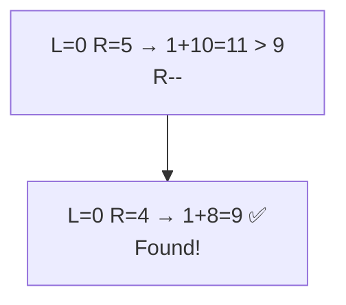
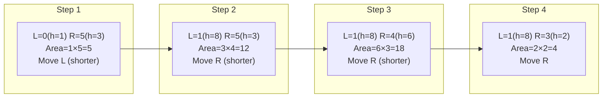

# Two Pointers — Opposite Ends

## Core Idea

Place one pointer at the **start** and one at the **end** of a sorted array. Move them toward each other based on a comparison. This eliminates one element per step, reducing O(n²) brute force to O(n). The invariant: everything outside `[left, right]` has already been considered.

## Template Code

```go
func twoSum(nums []int, target int) (int, int) {
    left, right := 0, len(nums)-1

    for left < right {
        sum := nums[left] + nums[right]
        if sum == target {
            return left, right
        } else if sum < target {
            left++ // need bigger sum
        } else {
            right-- // need smaller sum
        }
    }
    return -1, -1
}
```

## When To Use

- Two Sum on a sorted array
- Container With Most Water
- 3Sum (fix one, two-pointer on rest)
- Trapping Rain Water
- Any problem on **sorted data** comparing **pairs from both ends**

## Why Naive Fails

Checking all pairs is O(n²). The sorted order guarantees: if `sum < target`, moving `left` right increases the sum; if `sum > target`, moving `right` left decreases it. Each pointer moves at most n times → O(n).

## Mermaid Visualization

Two Sum with target 9 on `[1, 2, 4, 6, 8, 10]`:



Container With Most Water — pointer movement:



> **Key insight**: Always move the pointer pointing to the **shorter** element — moving the taller one can never increase the area.
