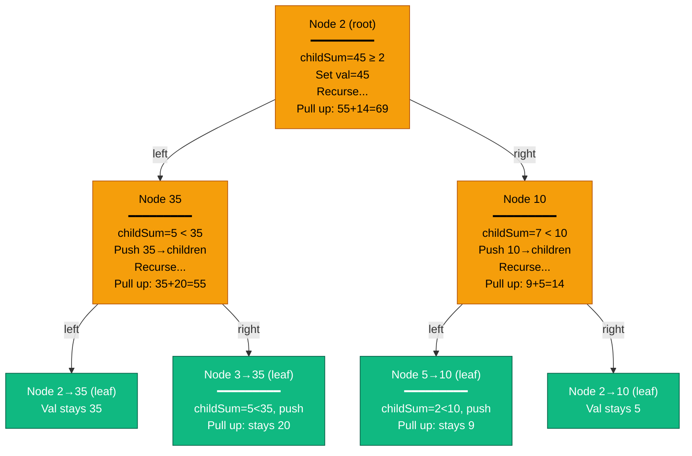
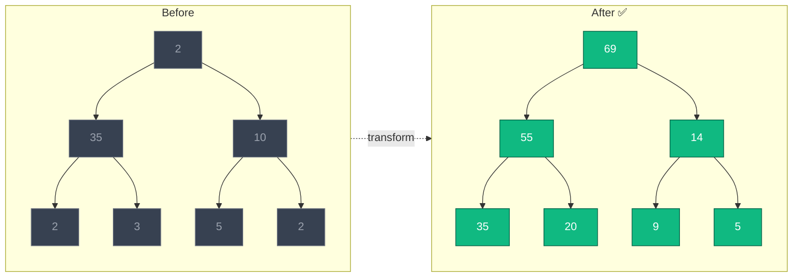
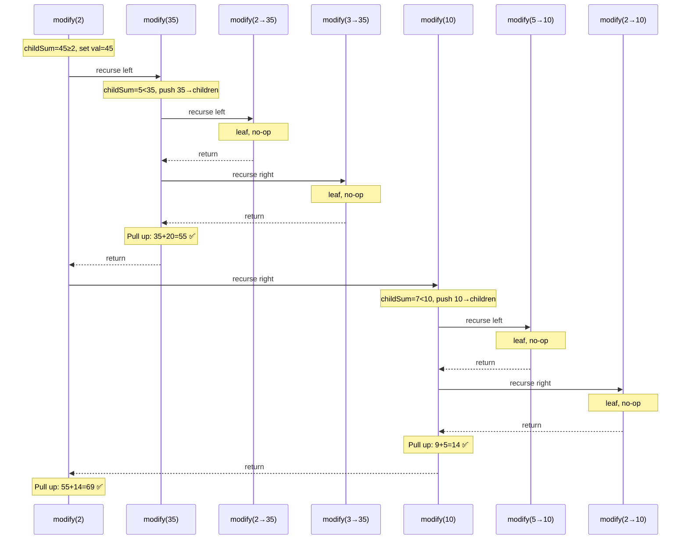

# Visualization — Children Sum Property

## Input Tree

```
        2
       / \
     35   10
    / \   / \
   2   3 5   2
```

## Recursion Trace — Push Down, Pull Up



## Step-by-Step State Table

### Phase 1: Push Down (Preorder)

| Step | Node | childSum | Compare | Action |
|------|------|----------|---------|--------|
| 1 | **2** (root) | 35+10=45 | 45 ≥ 2 | `root.Val = 45` |
| 2 | **35** | 2+3=5 | 5 < 35 | Push: `left.Val=35, right.Val=35` |
| 3 | **2→35** (leaf) | 0 | leaf | no-op |
| 4 | **3→35** (leaf) | 0 | leaf | no-op |
| 5 | **10** | 5+2=7 | 7 < 10 | Push: `left.Val=10, right.Val=10` |
| 6 | **5→10** (leaf) | 0 | leaf | no-op |
| 7 | **2→10** (leaf) | 0 | leaf | no-op |

### Phase 2: Pull Up (Postorder)

| Step | Node | left.Val | right.Val | Pull Up |
|------|------|----------|-----------|---------|
| 8 | **35** | 35 | 35 | was pushed, but leaves → `35 + 20 = 55`* |
| 9 | **10** | 10 | 10 | `9 + 5 = 14`* |
| 10 | **root** | 55 | 14 | `55 + 14 = 69` |

> *Leaf values stabilize after push-down. Internal nodes get their final values from pull-up.

## Before vs After



## Call Stack (Sequence View)



## Key Insight

> The push-down doesn't need to be "correct" — it just needs to ensure **enough budget** exists in the subtree. The pull-up phase will fix the parent to the exact sum of children. This is why we can naively overwrite both children with the parent's value.
