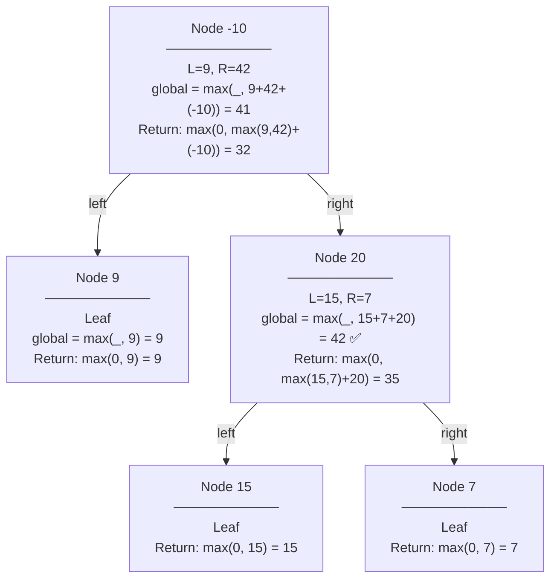
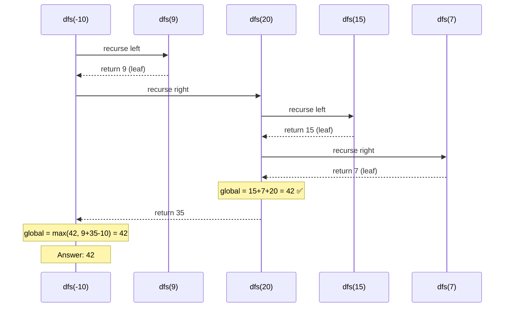

# Visualization — Max Path Sum

## Input Tree

```
        -10
        / \
       9   20
           / \
          15   7
```

## Recursion Tree with Return Values



## Call Stack (Sequence Diagram)



## State at Each Node

| Node | Left Return | Right Return | Global Update | Return to Parent |
|------|------------|--------------|---------------|------------------|
| 15 | 0 | 0 | 15 | 15 |
| 7 | 0 | 0 | 7 | 7 |
| 20 | 15 | 7 | **15+7+20=42** | 35 |
| 9 | 0 | 0 | 9 | 9 |
| -10 | 9 | 35 | 9+35-10=34 | 32 |

**Answer**: 42 (path: 15 → 20 → 7)

> Node 20 is where the magic happens — it forks through both children. Its return to parent (35) drops one child, but the global already captured the full fork.
