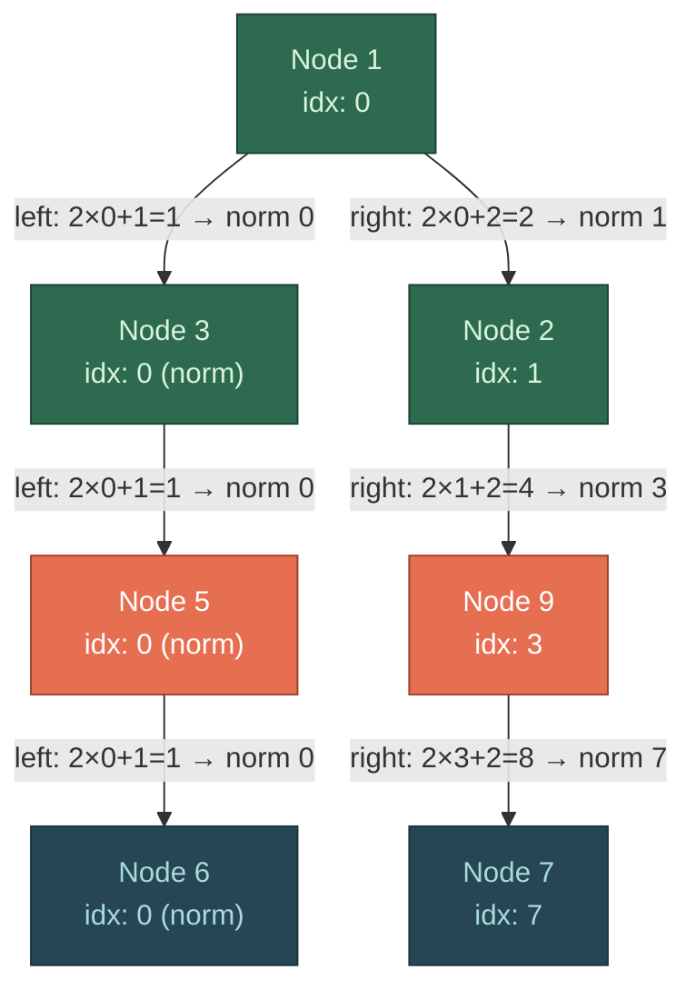
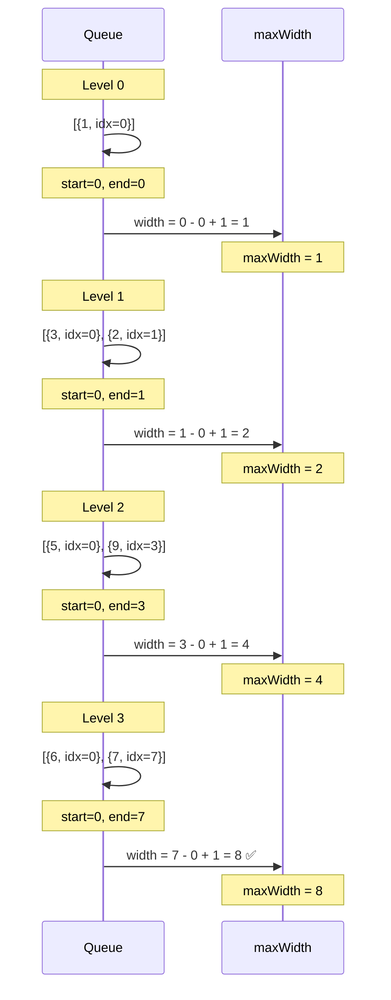

# Visualization — Maximum Width of Binary Tree

## Input Tree

```
         1
        / \
       3   2
      /     \
     5       9
    /         \
   6           7
```

## BFS Queue Walk-Through



## Level-by-Level State



## State Table

| Level | Queue Contents | Start Idx | End Idx | Width | maxWidth |
|-------|---------------|-----------|---------|-------|----------|
| 0 | `[{1, 0}]` | 0 | 0 | 1 | 1 |
| 1 | `[{3, 0}, {2, 1}]` | 0 | 1 | 2 | 2 |
| 2 | `[{5, 0}, {9, 3}]` | 0 | 3 | 4 | 4 |
| 3 | `[{6, 0}, {7, 7}]` | 0 | 7 | 8 | **8** |

**Answer**: 8 (the gap between node 6 and node 7 at level 3 spans 8 positions in a complete binary tree)

## Index Normalization Detail

```
Level 2 (before normalization):
  Node 5 raw idx = 2*0+1 = 1   →  minus start(1) → 0
  Node 9 raw idx = 2*1+2 = 4   →  minus start(1) → 3

Level 3 (children use normalized parents):
  Node 6: 2×0+1 = 1  →  minus start(1) → 0
  Node 7: 2×3+2 = 8  →  minus start(1) → 7

Width = 7 - 0 + 1 = 8
```

> **Key insight**: Without normalization, indices grow as 2ⁿ. By subtracting the level's start index each iteration, we keep numbers small while preserving the relative spacing.
