# Array Patterns — Visual Reference

> Mermaid diagrams for each core array pattern. Use for rapid revision.

---

## 🗺️ Pattern Selection Flowchart

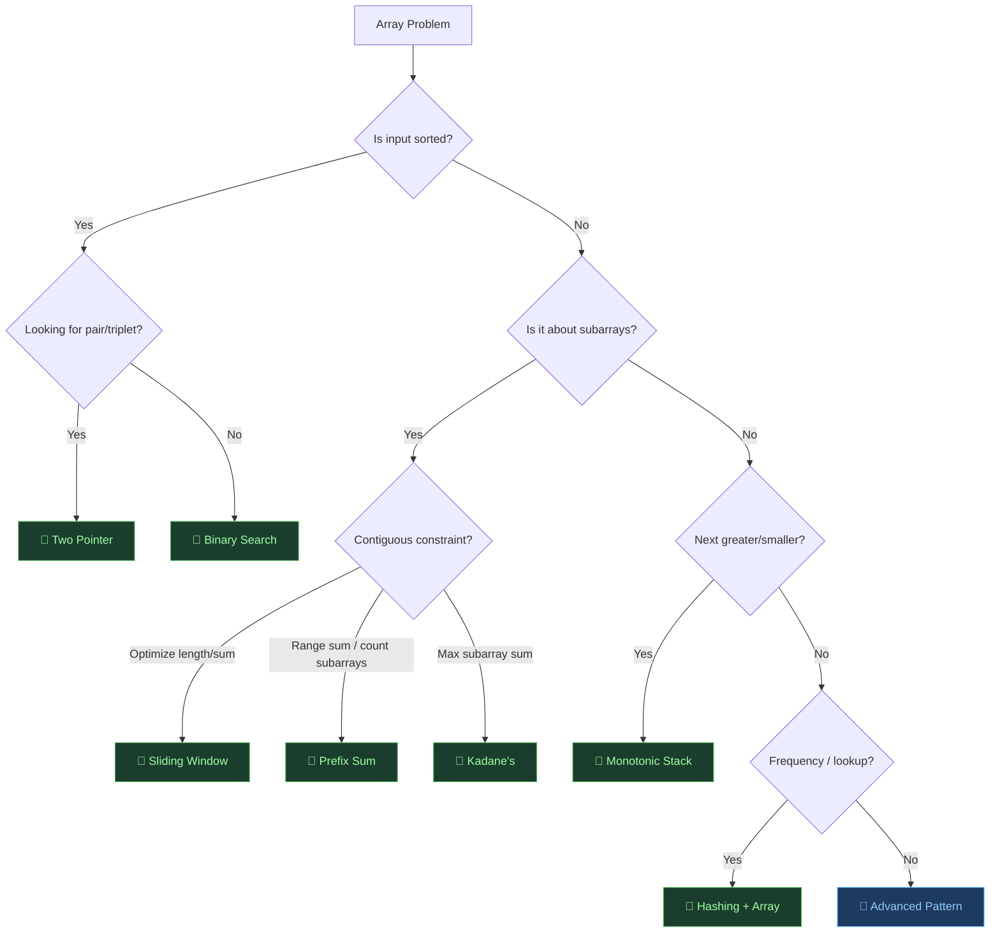

---

## 1. Two Pointer — Converging Search

### How Search Space Shrinks

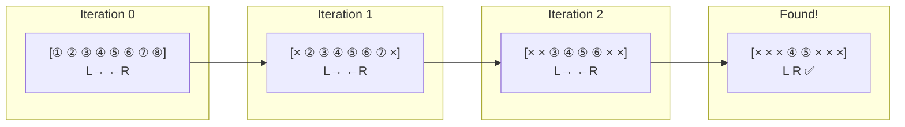

### Invariant Diagram

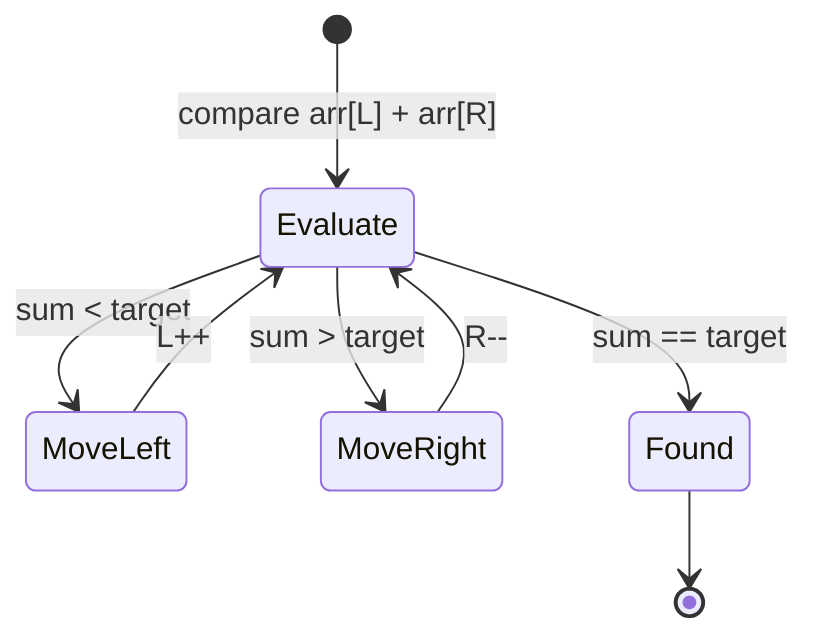

---

## 2. Sliding Window — Expand-Shrink Cycle

### Window Lifecycle

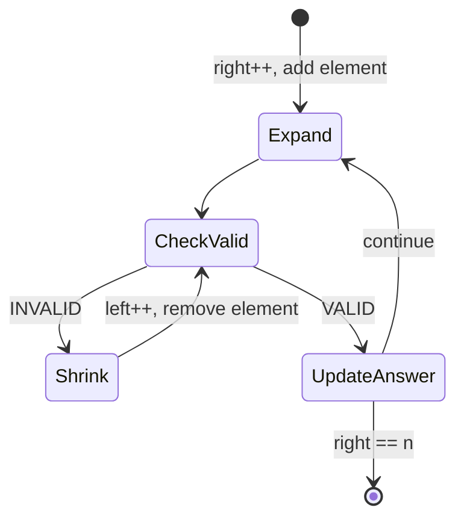

### Fixed vs Variable Window

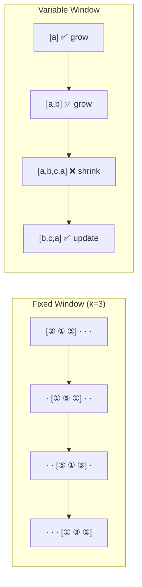

---

## 3. Prefix Sum — Precompute Once, Query O(1)

### Construction

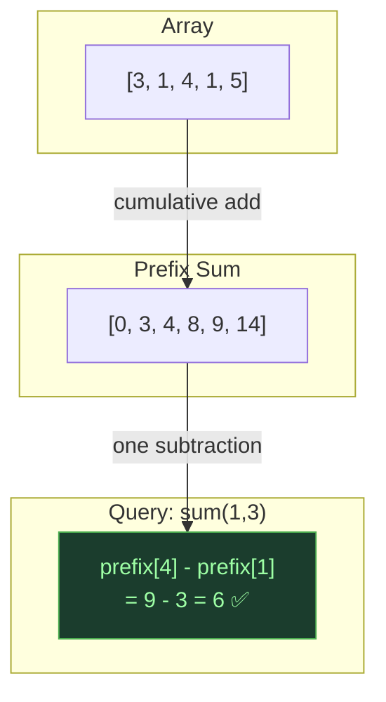

### Prefix + HashMap for "Count subarrays with sum K"

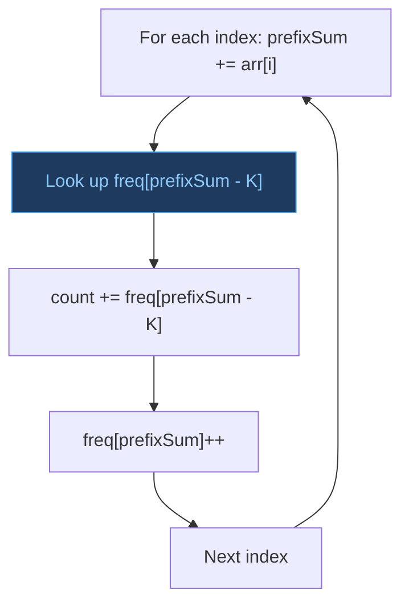

### Difference Array for Range Updates

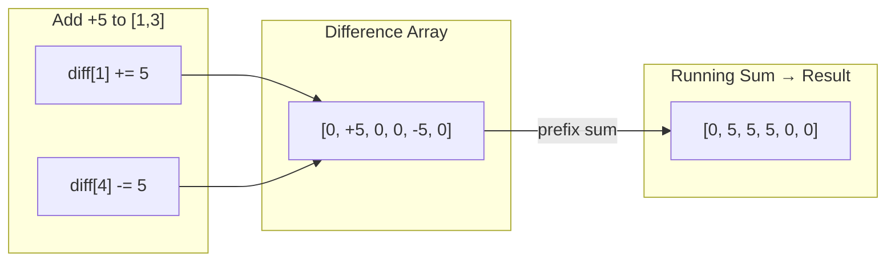

---

## 4. Kadane's — Extend vs Restart Decision

### Decision Tree at Each Index

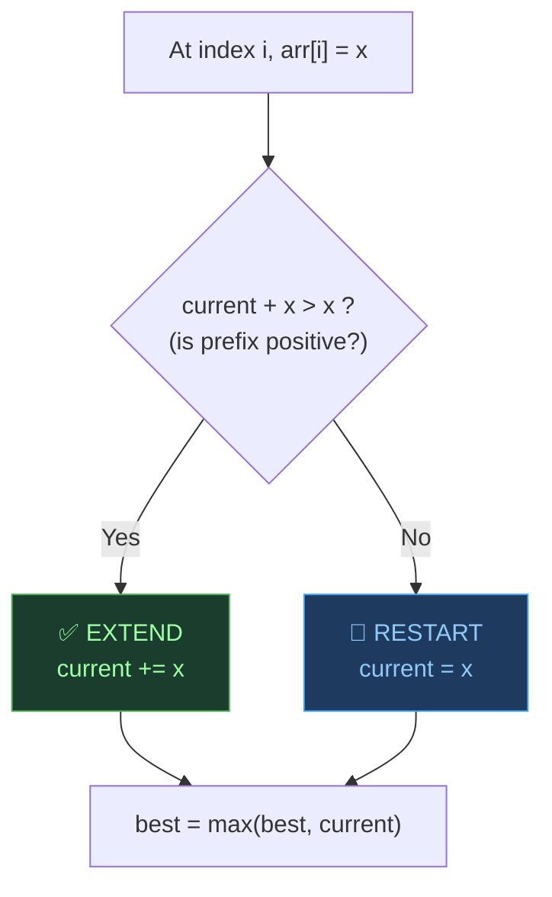

### Trace on `[-2, 1, -3, 4, -1, 2, 1, -5, 4]`

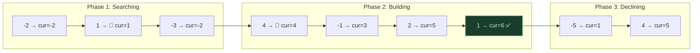

---

## 5. Binary Search — Halving the Space

### Classic Search Visualization

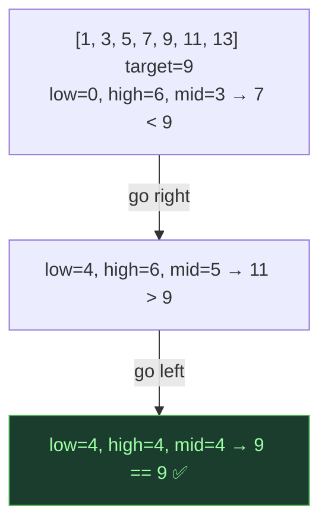

### Binary Search on Answer — Monotonicity

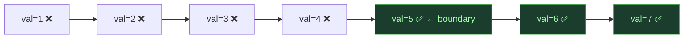

---

## 6. Monotonic Stack — Filtered History

### Stack State as Elements Arrive

Array: `[3, 7, 1, 4, 2]` — finding Next Greater

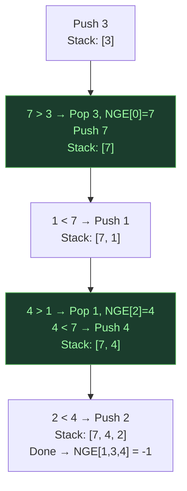

### Why Popping is Safe

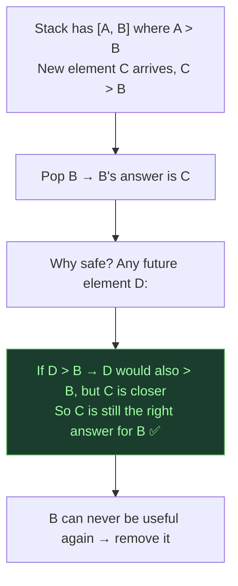

---

## 7. Hashing + Array — Domain-Aware Lookup

### Decision: HashMap vs Array Bucket

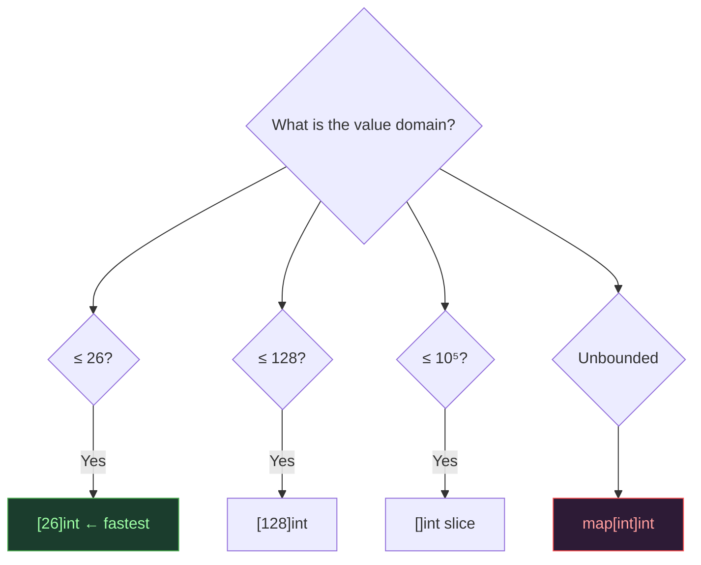

### In-Place Marking: Values in [1,n]

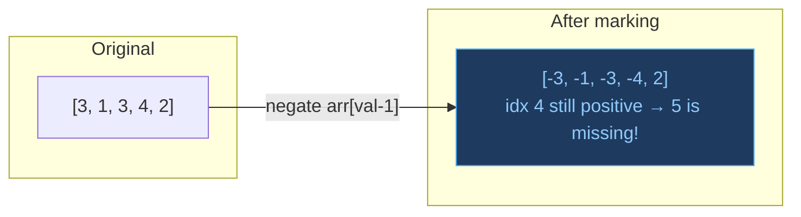

---

## 🧩 Advanced Patterns

### Boyer-Moore Voting

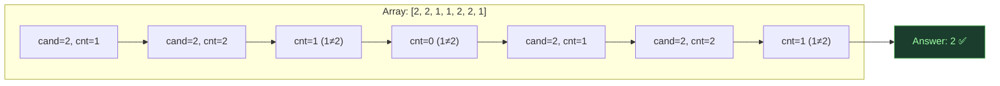

### Dutch National Flag (3-Way Partition)

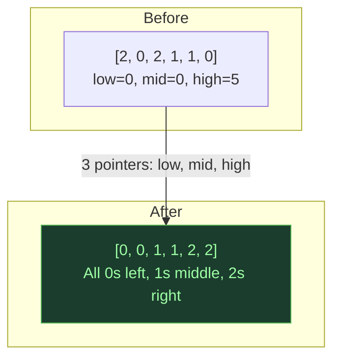
