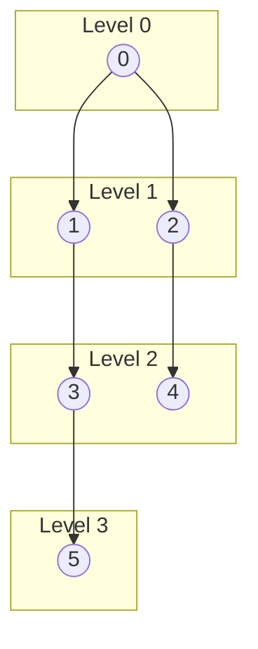
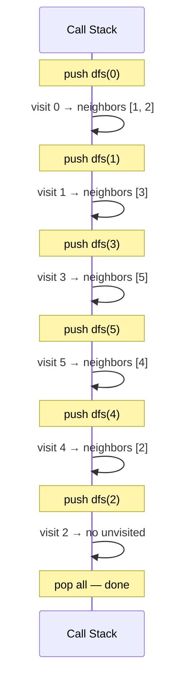

# Graph Traversal Visualization — BFS vs DFS

## Sample Graph

```
    0
   / \
  1   2
  |   |
  3   4
   \ /
    5
```

Adjacency: `0→[1,2], 1→[0,3], 2→[0,4], 3→[1,5], 4→[2,5], 5→[3,4]`

## BFS — Level Order Expansion



### BFS Queue Trace

| Step | Queue | Visited | Processing |
|------|-------|---------|------------|
| 0 | [0] | {0} | start |
| 1 | [1, 2] | {0,1,2} | dequeue 0 |
| 2 | [2, 3] | {0,1,2,3} | dequeue 1 |
| 3 | [3, 4] | {0,1,2,3,4} | dequeue 2 |
| 4 | [4, 5] | {0,1,2,3,4,5} | dequeue 3 |
| 5 | [5] | {0,1,2,3,4,5} | dequeue 4 |
| 6 | [] | {0,1,2,3,4,5} | dequeue 5 |

## DFS — Depth-First Stack Trace



### DFS Visit Order: `0 → 1 → 3 → 5 → 4 → 2`
### BFS Visit Order: `0 → 1 → 2 → 3 → 4 → 5`

> **Takeaway**: BFS visits by proximity (level). DFS visits by depth (follows one path to the end before backtracking).
