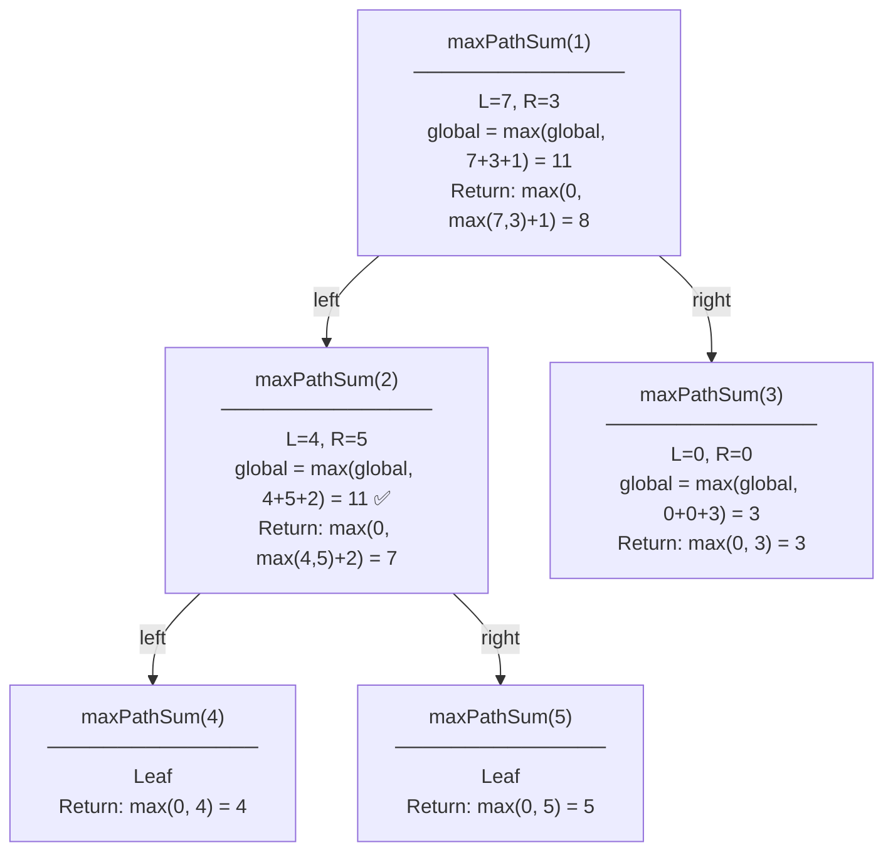
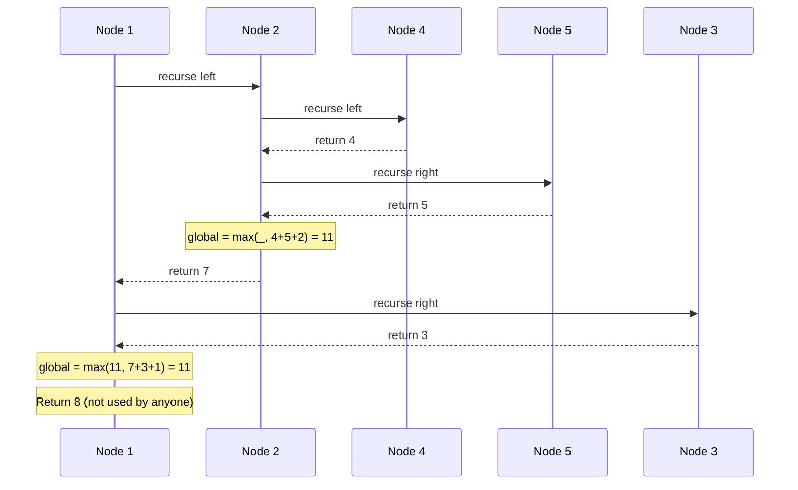

# Max Path Sum — Recursion Tree Visualization

This visualization traces `maxPathSum` on the tree `[1, 2, 3, 4, 5]`.

## The Tree

```
        1
       / \
      2   3
     / \
    4   5
```

## Recursion Tree with Return Values



## Call Stack Trace



## Level-by-Level Analysis

| Level | Node | Left Return | Right Return | Global Update | Return to Parent |
|-------|------|-------------|--------------|---------------|------------------|
| 2 | 4 | — | — | 4 | 4 |
| 2 | 5 | — | — | 5 | 5 |
| 1 | 2 | 4 | 5 | **4+5+2=11** | 7 |
| 1 | 3 | 0 | 0 | 3 | 3 |
| 0 | 1 | 7 | 3 | 7+3+1=11 | 8 |

**Answer**: Global max = **11** (path 4→2→5)

> The return value at root (8) is never used — it's only meaningful if this tree were a subtree of something larger.
