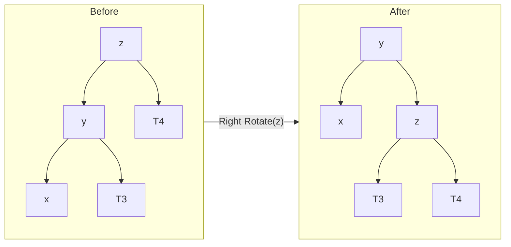
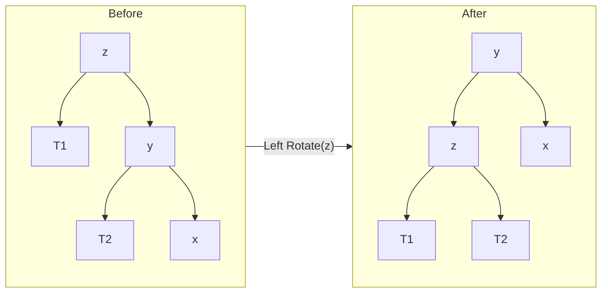
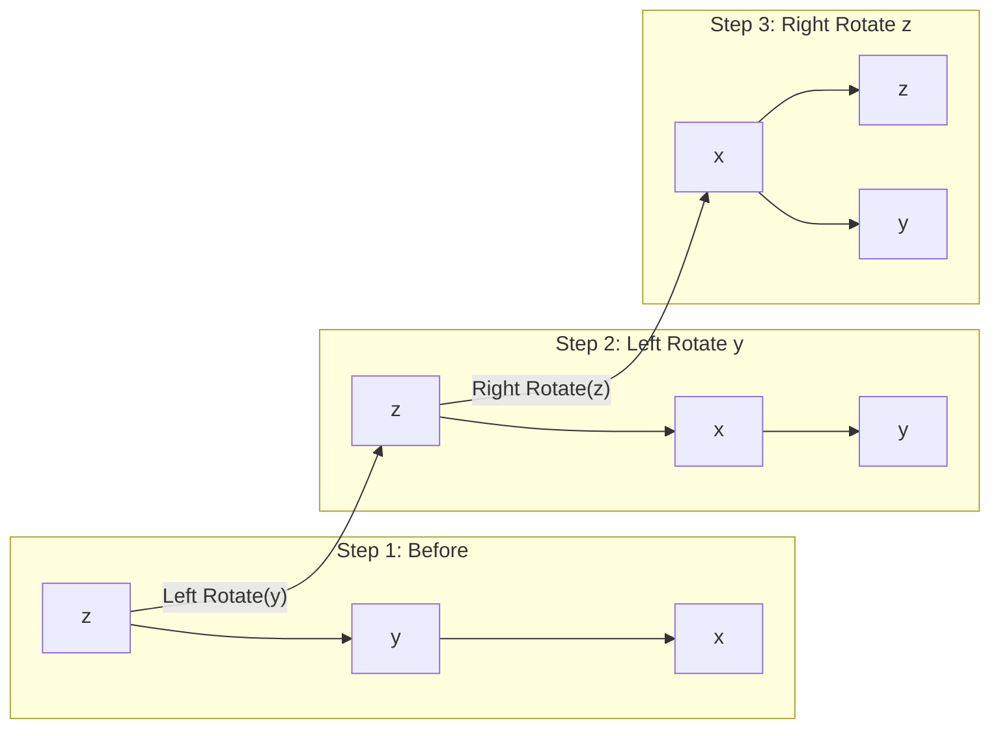
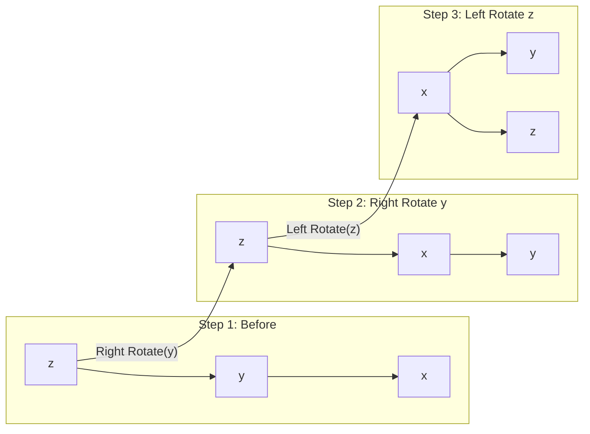

# AVL Tree Rotations — Visual Guide

## Why Rotations?

After an insertion or deletion, the tree may become **unbalanced** (height difference > 1). Rotations restore balance in O(1) while preserving BST ordering.

## Right Rotation (Left-Heavy / LL Case)

```
Before:         After:
    z               y
   / \             / \
  y   T4          x   z
 / \             /   / \
x   T3          T1  T3  T4
/
T1
```



## Left Rotation (Right-Heavy / RR Case)

```
Before:         After:
  z                y
 / \              / \
T1   y           z   x
    / \         / \   \
   T2  x      T1  T2  T3
        \
        T3
```



## Left-Right (LR Case) — Double Rotation



## Right-Left (RL Case) — Double Rotation



## Quick Reference

| Case | Balance Factor | Fix |
|------|---------------|-----|
| LL | bf(z)=2, bf(y)=1 | Right rotate z |
| RR | bf(z)=-2, bf(y)=-1 | Left rotate z |
| LR | bf(z)=2, bf(y)=-1 | Left rotate y, then right rotate z |
| RL | bf(z)=-2, bf(y)=1 | Right rotate y, then left rotate z |
